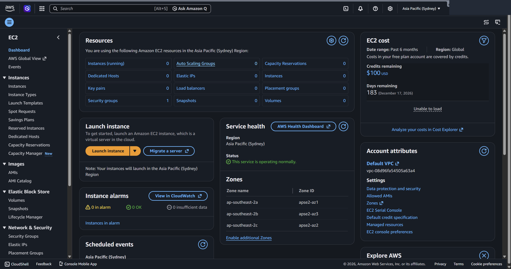
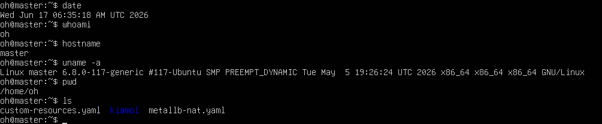

클라우드 첫 주차. 클라우드 개념을 정리하고, AWS 계정 생성과 VMware 우분투 설치로 이후 실습 환경을 준비한다.

## 개념 요약

- **온프레미스 vs 클라우드** — 온프레미스는 서버·네트워크·공간을 직접 갖춰 운영. 클라우드는 인터넷으로 자원을 필요할 때(on-demand) 빌려 쓰고 쓴 만큼 과금(pay per use).
- **이점** — 민첩성(필요 자원 즉시 확보)·탄력성(증감 자유)·비용 절감(사용량 기반).
- **구축 모델** — 퍼블릭(공급자 소유, 확장성)·프라이빗(직접 구축, 보안)·하이브리드(둘을 연결).
- **가상화** — 물리 자원을 나눠 가상 서버를 즉시 제공. **서버리스** — 호출될 때만 서버가 가동돼 사용 시간만 과금.

서비스 유형은 공급자와 사용자의 관리 범위로 나뉜다.

| 유형 | 사용자가 관리 | 비유 |
|---|---|---|
| IaaS | OS·미들웨어·앱 | 밀키트 |
| PaaS | 앱만 | 배달 주문 |
| SaaS | 이용만 | 출장 뷔페 |

AWS 핵심 서비스: **EC2**(컴퓨팅)·**S3/EBS/EFS**(스토리지)·**RDS/DynamoDB**(DB)·**IAM**(권한). 인프라는 리전(서울 등)과 그 안의 가용 영역으로 구성된다.

## 실습 ① AWS 가입 (프리 티어)

가입 흐름: 이메일·계정명 → 6자리 확인 코드 → 루트 암호 → 개인정보(영문) → 결제정보(확인용 소액 결제, 곧 취소) → 휴대전화 SMS 인증 → **기본 지원(무료)** 플랜 → 관리 콘솔 진입.


*▲ AWS 관리 콘솔에 로그인한 화면(EC2 대시보드) — 상단 서비스 검색창, 우상단 리전 선택, 프리 플랜 크레딧($100·잔여 183일)과 자원 현황을 확인할 수 있다.*

## 실습 ② VMware에 우분투 설치

1. VMware Workstation Player 설치
2. 새 가상머신 생성(게스트 OS는 나중에 설치) → 종류 Linux, 디스크 20GB
3. ubuntu.com에서 ISO 내려받아 연결 후 부팅
4. 설치: 언어·키보드 한국어, 최소 설치, "디스크를 지우고 Ubuntu 설치", 시간대 Seoul, 계정 `user1`·호스트 `myubuntu`
5. 재부팅 후 로그인

기초 리눅스 명령어(`명령 [옵션] [인자]` 구조):

```bash
date            # 날짜·시간 출력
clear           # 화면 지우기
man date        # 매뉴얼 보기
passwd          # 비밀번호 변경
ls -l /etc      # ls(명령) + -l(옵션) + /etc(인자)
```


*▲ Ubuntu 24.04 터미널에서 `date`·`whoami`·`hostname`·`uname -a`·`pwd`·`ls` 등 기초 리눅스 명령을 실행한 결과.*

## 막혔던 점

- VMware에서 우분투가 느리거나 부팅 실패 → 메모리 2GB↑·CPU 2코어로 상향, BIOS에서 가상화(VT-x/AMD-V) 활성화(윈도는 Hyper-V 끄기).
- AWS 결제 카드 등록 실패 → 해외 결제 가능 카드 + 영문 주소·이름이 카드와 일치하는지 확인. 가입 시 소액 결제는 확인용으로 곧 취소.
- 프리 티어 과금 주의 → 12개월 무료지만 한도 초과·일부 서비스는 과금. 실습 후 생성 자원(인스턴스 등)은 반드시 삭제.
