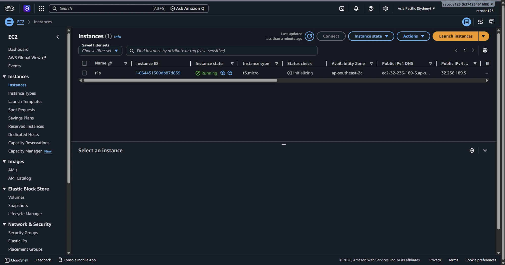
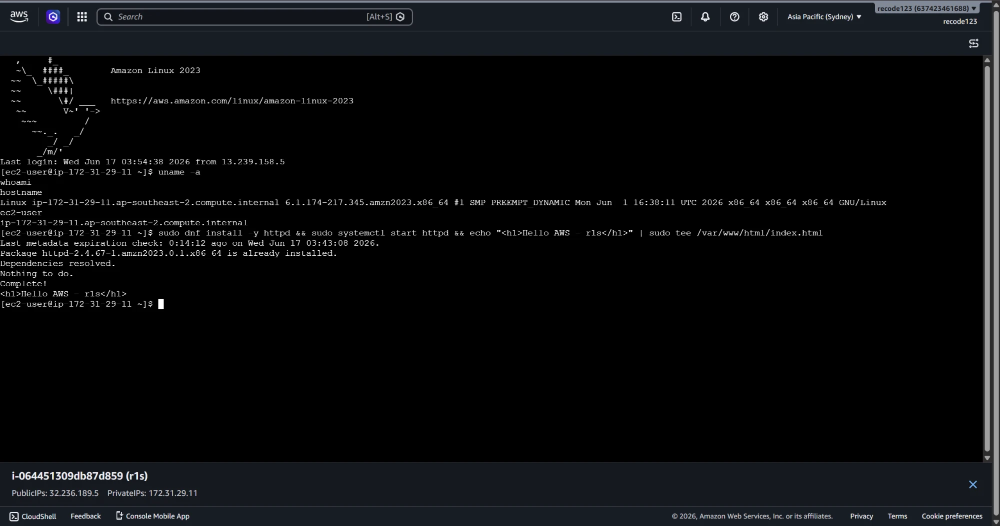
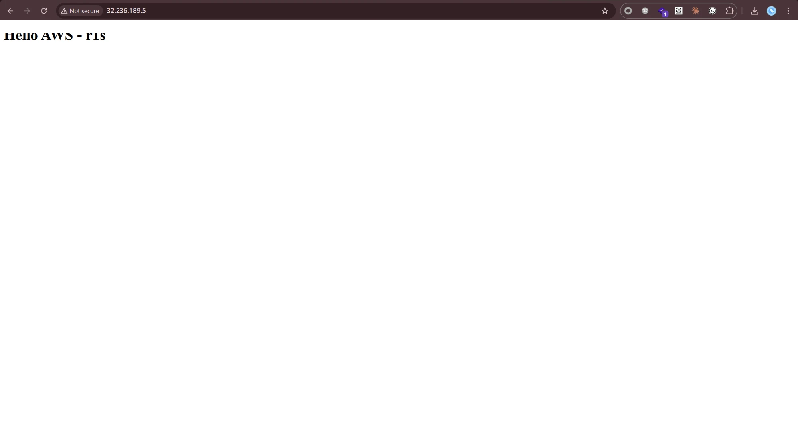

AWS 컴퓨팅 주차. AMI로 EC2 인스턴스를 배포 → SSH 접속 → 웹 접속 확인 → CloudWatch 모니터링 → 자원 삭제 순서로 실습한다.

## 개념 요약

- **EC2 (Elastic Compute Cloud)** — 서버 자원을 인스턴스(가상 머신) 형태로 제공하는 컴퓨팅 서비스.
- 인스턴스 생성 시 반드시 정하는 5가지: **AMI / 인스턴스 유형 / 네트워크 / 스토리지 / 보안 그룹**.
- 프리 티어는 **t2.micro** 유형만 매달 750시간 무료. 실습은 t2.micro로 진행한다.
- 외부 공개 3조건: **퍼블릭 서브넷 배치 + 퍼블릭 IP 부여 + 보안 그룹 허용**.
- `stopped`는 일시 중지(EBS 과금 지속), `terminated`는 영구 삭제.

## 단계 ① AMI로 EC2 인스턴스 배포

1. EC2 콘솔 → **[인스턴스 시작]** 클릭
2. **AMI** 선택 — AWS 기본 AMI(예: Ubuntu) 지정
3. **인스턴스 유형** — **t2.micro** 선택(프리 티어)
4. **네트워크** — 배포할 VPC·서브넷 지정
5. **키 페어** — 새로 생성 후 프라이빗 키(`.pem`)를 PC에 저장
6. **스토리지** — EBS 용량 지정
7. **보안 그룹** — 인바운드에 SSH(22), HTTP(80) 허용 규칙 추가
8. **[인스턴스 시작]** → 상태가 `running`이 될 때까지 대기


*▲ AWS EC2 콘솔에서 t3.micro 인스턴스(r1s)를 시작해 상태가 `Running` 이 된 모습.*

## 단계 ② SSH로 인스턴스 접속

프라이빗 키로 접속한다.

```bash
chmod 400 키페어.pem                       # 프라이빗 키 권한 설정(소유자 읽기 전용)
ssh -i 키페어.pem ubuntu@<퍼블릭IP>        # 프라이빗 키로 EC2에 SSH 접속
```


*▲ EC2 Instance Connect로 접속해 `uname -a`·`whoami`·`hostname` 으로 Amazon Linux 2023 환경을 확인하고 웹 서버(httpd)를 설치한 화면.*

## 단계 ③ 웹 서비스 접속

인스턴스에 웹 서비스를 설정한 뒤, 브라우저 주소창에 **퍼블릭 IP**를 입력해 접속을 확인한다(`http://<퍼블릭IP>`).


*▲ 인스턴스의 퍼블릭 IP(`http://32.236.189.5`)로 접속하니 EC2에서 띄운 웹 페이지(Hello AWS - r1s)가 응답한다.*

## 단계 ④ CloudWatch 모니터링

인스턴스의 **모니터링** 탭에서 CloudWatch 지표(CPU 사용률 등) 그래프를 확인한다.

!!! capture "CloudWatch 지표 그래프"
    (실습 화면 캡처)

## 단계 ⑤ 리눅스 명령어로 인스턴스 정보 확인

```bash
hostname        # 호스트 이름 확인
uname -a        # 커널·아키텍처 등 시스템 정보
df -h           # 디스크 사용량 확인
free -h         # 메모리 사용량 확인
```

## 단계 ⑥ 자원 전체 삭제

과금을 막기 위해 인스턴스를 **종료(terminate)** 하고, 남은 EBS 볼륨·키 페어·보안 그룹도 확인해 삭제한다.

!!! warning "stopped만으로는 과금이 멈추지 않는다"
    `stopped`는 컴퓨팅 요금만 멈추고 **EBS 볼륨에는 과금이 계속**된다. 실습 후에는 인스턴스를 **terminate**하고 남은 자원까지 삭제한다.

## 막혔던 점

- SSH가 22번 포트에서 timeout → 보안 그룹 인바운드에 SSH(TCP 22) 허용 추가(출발지는 내 IP로 좁힘).
- 브라우저로 웹 페이지가 안 열림 → 인바운드에 HTTP(80) 허용 + 퍼블릭 IP 할당 확인(외부 공개 3조건 충족).
- 프라이빗 키 권한 오류로 SSH 거부 → `chmod 400 키페어.pem` 후 재접속.
- 퍼블릭 IP가 재시작마다 바뀜 → 고정이 필요하면 **Elastic IP** 할당.
