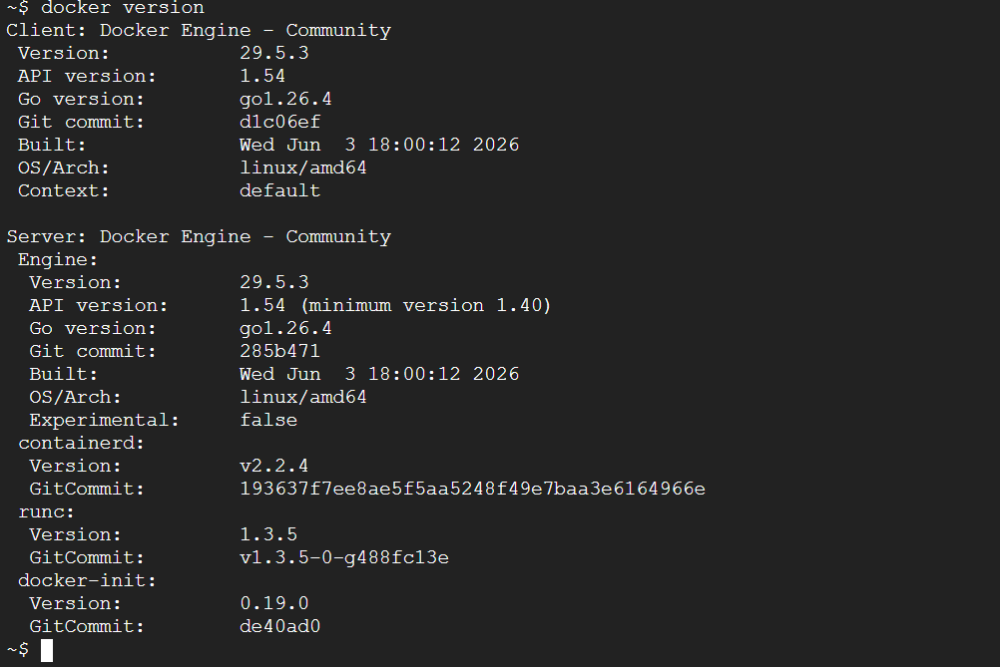
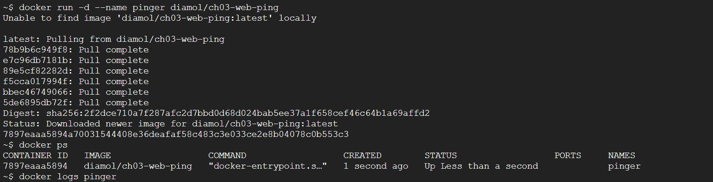
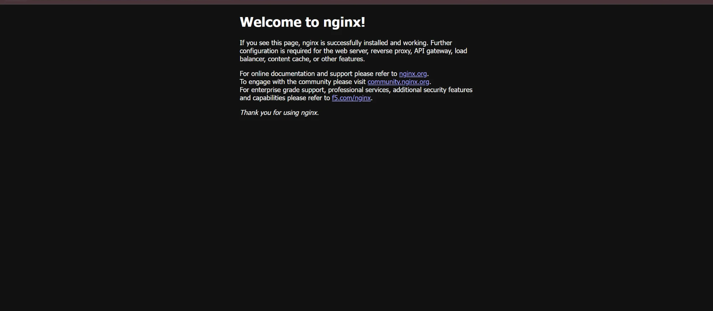
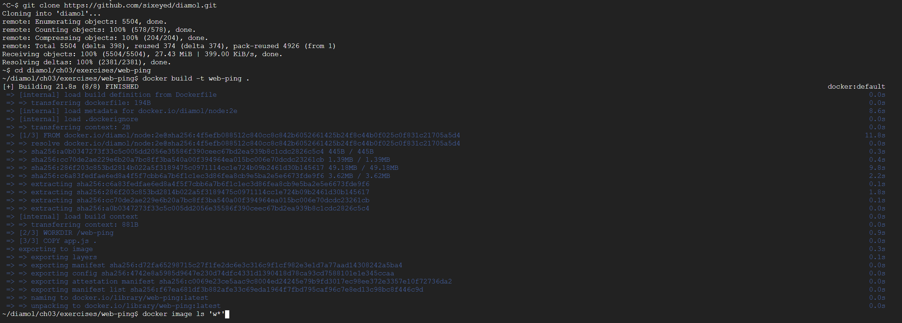
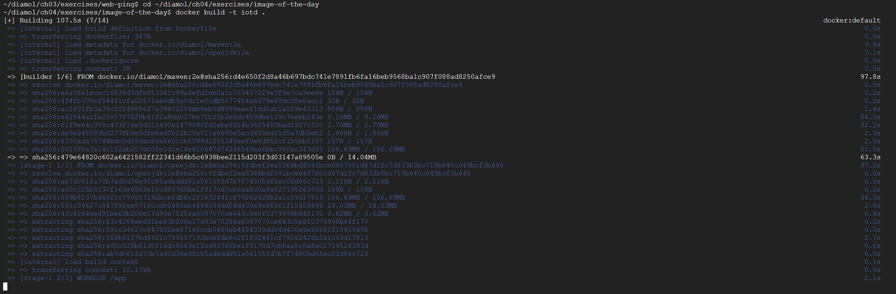

도커 첫 주차. 우분투에 도커 설치 → 컨테이너 실행 → Dockerfile 빌드 → 멀티 스테이지 빌드 순서로 실습한다.

## 도커 설치

```bash
# 옛 버전 제거
sudo apt-get remove docker docker-engine docker.io containerd runc
# 필수 패키지 설치
sudo apt-get update
sudo apt-get install apt-transport-https ca-certificates curl gnupg-agent software-properties-common
# 도커 GPG 키 + 저장소 등록
curl -fsSL https://download.docker.com/linux/ubuntu/gpg | sudo apt-key add -
sudo apt-key fingerprint 0EBFCD88
sudo add-apt-repository "deb [arch=amd64] https://download.docker.com/linux/ubuntu $(lsb_release -cs) stable"
# 도커 엔진 설치
sudo apt-get update
sudo apt-get install docker-ce docker-ce-cli containerd.io
# 설치 확인
docker version
docker-compose version
```

`docker version` 에 Client·Server 버전이 모두 나오면 정상.


*▲ `docker version` — 클라이언트와 서버(Docker Engine 29.5.3)가 함께 표시되면 데몬 정상 동작.*

## 컨테이너 기본 명령

```bash
docker container run --interactive --tty diamol/base  # 컨테이너 셸 진입
hostname                       # 컨테이너 호스트명
date
docker container ls            # 실행 중 컨테이너
docker container top <id>      # 컨테이너 내 프로세스
docker container logs <id>     # 로그
docker container inspect <id>  # 상세 정보(JSON)
```


*▲ `docker run -d` 로 컨테이너를 백그라운드 실행하고 `docker ps`·`docker logs` 로 상태와 로그를 확인.*

## 컨테이너로 웹 호스팅

```bash
docker container ls --all                                          # 멈춘 것까지 전체
docker container stats <이미지>                                     # 리소스 사용량
docker container rm --force $(docker container ls --all --quiet)   # 전체 삭제
```

브라우저에서 `http://localhost:8080` 접속 → 컨테이너가 응답.


*▲ `docker run -d -p 8080:80 nginx` 후 브라우저로 접속하니 컨테이너가 띄운 nginx 페이지가 응답한다.*

## Docker Hub 이미지 실행

```bash
docker image pull diamol/ch03-web-ping
docker container run -d --name web-ping diamol/ch03-web-ping     # 백그라운드 실행
docker container logs web-ping
docker rm -f web-ping
docker container run --env TARGET=google.com diamol/ch03-web-ping # 환경 변수로 대상 변경
```

## Dockerfile 빌드

web-ping Dockerfile:

```dockerfile
FROM diamol/node
ENV TARGET="blog.sixeyed.com"
ENV METHOD="HEAD"
ENV INTERVAL="3000"
WORKDIR /web-ping
COPY app.js .
CMD ["node", "/web-ping/app.js"]
```

```bash
cd ch03/exercises/web-ping
docker image build --tag web-ping .   # 이미지 빌드
docker image ls 'w*'
docker image history web-ping         # 레이어 내역
```

레이어 캐시: 자주 바뀌는 `COPY app.js` 는 뒤쪽에 둬야 캐시 재사용.


*▲ `docker build` 로 Dockerfile에서 이미지를 빌드하는 과정 — 인스트럭션이 레이어 단위로 실행된다.*

## 멀티 스테이지 빌드

기본 구조 (build → test → 최종 단계, `COPY --from=` 으로 결과물만 전달):

```dockerfile
FROM diamol/base AS build-stage
RUN echo 'Building...' > /build.txt
FROM diamol/base AS test-stage
COPY --from=build-stage /build.txt /build.txt
RUN echo 'Testing...' >> /build.txt
FROM diamol/base
COPY --from=test-stage /build.txt /build.txt
CMD cat /build.txt
```

Java(Maven) 멀티 스테이지 — 빌드 도구는 빌더 단계에만, 최종 이미지엔 JDK·jar만:

```dockerfile
FROM diamol/maven AS builder
WORKDIR /usr/src/iotd
COPY pom.xml .
RUN mvn -B dependency:go-offline
COPY . .
RUN mvn package
FROM diamol/openjdk
WORKDIR /app
COPY --from=builder /usr/src/iotd/target/iotd-service-0.1.0.jar .
EXPOSE 80
ENTRYPOINT ["java", "-jar", "/app/iotd-service-0.1.0.jar"]
```

`docker image ls` 로 빌더 이미지보다 최종 이미지가 작음을 확인.


*▲ 멀티 스테이지 빌드 — 빌더 단계(diamol/maven)와 최종 실행 이미지를 나눠 빌드한다.*

## 막혔던 점

- `docker` permission denied → `sudo usermod -aG docker $USER` 후 재로그인.
- 컨테이너가 바로 종료(Exited) → 서버형은 `-d` + 상주 프로세스(CMD/ENTRYPOINT) 필요.
- 빌드가 매번 느림 → `COPY pom.xml` + 의존성 설치를 먼저, `COPY . .` 는 뒤로 (캐시 재사용).
