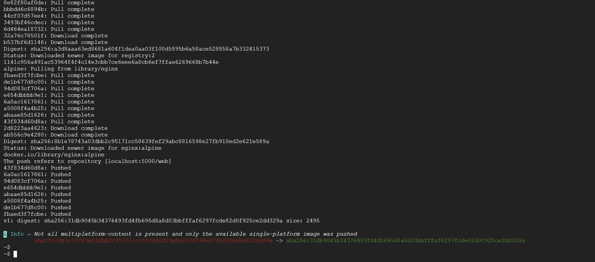
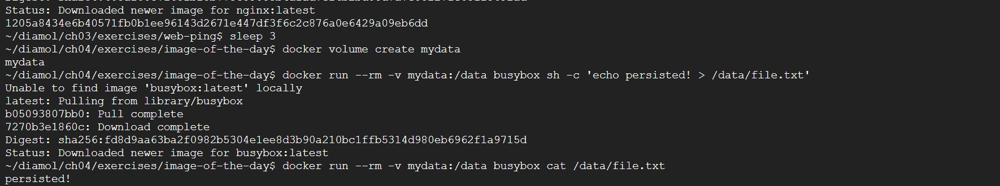
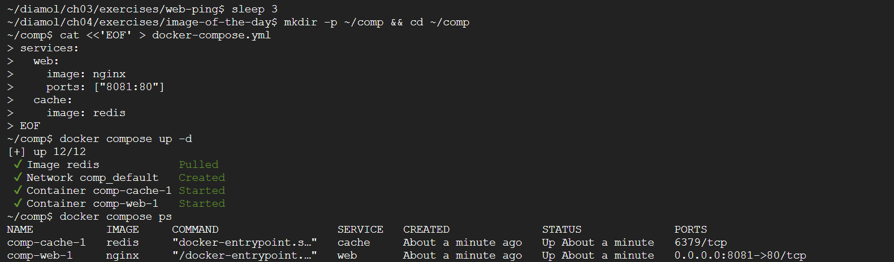
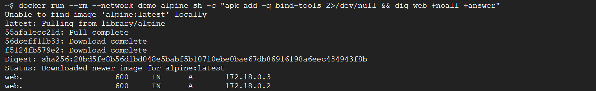

도커 두 번째 주차. 이미지를 레지스트리에 공유(Docker Hub·사설 registry), 볼륨/바인드 마운트로 데이터 보존, 도커 컴포즈로 다중 컨테이너 실행 순서로 실습한다.

## 이미지 참조 구조

이미지는 `레지스트리/계정/리포지터리:태그` 형태로 참조한다. 레지스트리를 생략하면 기본값 Docker Hub가 적용된다.

## Docker Hub 푸시

```bash
docker login --username $dockerId                          # 허브 로그인($dockerId=계정명)
docker image tag image-gallery $dockerId/image-gallery:v1  # 계정명 포함 참조 부여
docker image push $dockerId/image-gallery:v1               # 레지스트리에 업로드
```

푸시 참조에는 푸시 권한을 가진 계정명이 포함돼야 한다.

!!! note "Docker Hub 푸시 결과"
    `docker login` 성공 후 `docker image push $dockerId/image-gallery:v1`을 실행하면 레이어가 순서대로 업로드되며 각 레이어에 `Pushed`, 마지막에 다이제스트(`sha256:...`)가 출력된다. 이미 허브에 있는 베이스 레이어는 `Mounted from ...`로 건너뛴다. 레이어별 업로드 동작은 아래 사설 레지스트리 푸시 화면과 동일하다.

## 사설 레지스트리

```bash
docker container run -d -p 5000:5000 --restart always diamol/registry  # 레지스트리 컨테이너 상주
```

hosts 파일에 도메인 별명 추가:

```bash
127.0.0.1 registry.local
```

```bash
docker image tag image-gallery registry.local:5000/gallery/ui:v1  # 사설 도메인 참조 부여
```

HTTPS가 아닌 레지스트리는 기본 거부되므로 데몬 설정에 허용 목록을 추가한다.

```json
{
  "insecure-registries" : ["registry.local:5000"]
}
```

```bash
docker info                                            # 허용 목록 적용 확인
docker image push registry.local:5000/gallery/ui:v1   # 사설 레지스트리에 푸시
```

`insecure-registries`는 평문 통신을 허용하므로 실습·신뢰된 내부망에서만 사용한다.


*▲ `docker push localhost:5000/web:v1` — 로컬에 띄운 사설 레지스트리(registry:2)에 이미지가 레이어별로 업로드된다.*

## 태그 전략과 골든 이미지

하나의 이미지에 `major.minor.patch`와 `latest`를 조합해 붙인다. 운영은 재현성을 위해 정확한 버전(`2.1.106`), 개발은 `latest`를 함께 둔다. 공식 이미지를 조직 표준 베이스로 캡슐화한 것이 골든 이미지다.

## 컨테이너 데이터 휘발성

컨테이너 파일 시스템은 읽기 전용 이미지 레이어 위에 기록 가능 레이어가 얹힌 구조다. 변경은 기록 가능 레이어에만 쌓이고, 컨테이너를 삭제하면 함께 소멸한다.

```bash
docker container run --name rn1 diamol/ch06-random-number  # 파일에 무작위 숫자 기록
docker container cp rn1:/random/number.txt number1.txt     # 컨테이너 → 호스트 복사
cat number1.txt
docker container start --attach f1                          # 재시작 시 다른 값 확인
```

유상태(stateful) 컴포넌트는 디스크 보존이 필요하므로 볼륨 같은 영속 스토리지를 쓴다.

## 볼륨

볼륨은 컨테이너와 독립된 생애주기를 갖는 스토리지다.

```bash
docker volume create todo-list                                                       # 볼륨 생성
docker container run -d -p 8011:80 -v todo-list:$target --name todo-v1 diamol/ch06-todo-list  # 볼륨 연결 실행($target=내부 경로)
```

```bash
docker container run -d --name t3 --volumes-from todo1 diamol/ch06-todo-list  # 기존 컨테이너 볼륨 공유
docker container exec todo2 ls /data                                          # 공유 데이터 확인
```

Dockerfile에 `VOLUME <target-directory>`를 두면 컨테이너 실행 시 볼륨이 자동 생성된다.


*▲ 볼륨에 쓴 파일을 다른 컨테이너에서 그대로 읽는다 — 컨테이너가 사라져도 볼륨의 데이터는 유지된다.*

## 바인드 마운트

바인드 마운트는 호스트 디렉터리를 컨테이너에 직접 연결한다.

```bash
docker container run --mount type=bind,source=$source,target=$target -d -p 8012:80 diamol/ch06-todo-list  # 호스트↔컨테이너 연결($source=호스트, $target=컨테이너)
```

```bash
docker container run --mount type=bind,source=$source,target=$target,readonly diamol/ch06-todo-list  # 읽기 전용 연결
```

`source`에는 OS별 형식(윈도 `c:\data`, 리눅스 `/data`)에 맞는 절대경로를 넣는다.

## 도커 컴포즈

여러 컨테이너의 '원하는 상태'를 YAML에 기술하면 컴포즈가 컨테이너·네트워크·볼륨을 만든다.

```yaml
version: '3.7'
services:
  todo-web:
    image: diamol/ch06-todo-list
    ports:
      - "8020:80"
    networks:
      - app-net
networks:
  app-net:
    external:
      name: nat
```

```bash
docker network create nat        # 컴포즈가 쓸 네트워크 생성
docker-compose up                # 포그라운드 실행
docker-compose up --detach       # 백그라운드 실행
```

```bash
docker-compose up -d --scale iotd=3       # iotd 서비스 3개로 스케일 아웃
docker-compose logs --tail=1 iotd         # 각 컨테이너 로그 확인
```

```bash
docker-compose stop    # 중지
docker-compose start   # 시작
docker-compose down    # 컨테이너·네트워크 제거
```

`depends_on`으로 시작 순서를, `environment`·`secrets`로 설정·비밀값을 주입한다. DB가 필요하면 서비스로 함께 정의한다.

```yaml
services:
  todo-db:
    image: diamol/postgres:11.5
    ports:
      - "5433:5432"
  todo-web:
    image: diamol/ch06-todo-list
    ports:
      - "8020:80"
```


*▲ `docker compose up -d` 한 번으로 web(nginx)·cache(redis) 두 컨테이너를 함께 띄운 모습(`docker compose ps`).*

## 컨테이너 간 통신(내장 DNS)

도커 내장 DNS는 컨테이너 이름을 도메인 삼아 IP를 돌려준다. 스케일 아웃 시 모든 컨테이너 IP가 나온다.

```bash
docker container exec -it image-of-the-day_image-gallery_1 sh  # 웹 컨테이너 셸 진입
nslookup accesslog                                             # 서비스 이름으로 IP 조회
nslookup iotd                                                  # 스케일 아웃 시 다중 IP
```

대상이 컨테이너가 아니면 도커는 호스트로 요청을 넘겨 외부 IP를 조회한다.


*▲ `dig web` — 같은 `demo` 네트워크에 띄운 두 컨테이너(web1·web2)가 서비스 이름 `web` 하나로 묶여, 내장 DNS가 두 개의 IP(172.18.0.2·172.18.0.3)를 함께 돌려준다.*

## 막혔던 점

- 사설 레지스트리 push에서 HTTP/HTTPS 오류 → 데몬 설정에 `"insecure-registries":["registry.local:5000"]` 추가 후 도커 재시작, `docker info`로 확인.
- hosts 수정 권한 거부 / `docker login` 실패 → 윈도는 관리자 권한, 리눅스는 `sudo`로 수정. 로그인은 계정명 대소문자 정확히.
- 볼륨 누락으로 데이터 소멸 / 바인드 마운트 경로 오류 → `-v 볼륨명:경로` 연결, `source`는 절대경로.
- 컨테이너 이름 통신 실패 / `down` 후 재기동 실패 → 같은 네트워크(`nat`)에 묶고, 컴포즈는 같은 YAML이 있는 디렉터리에서 실행.
