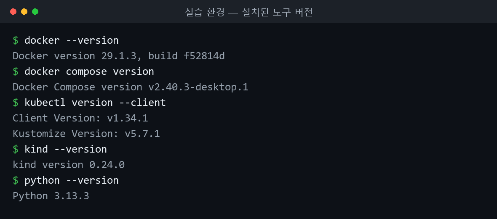
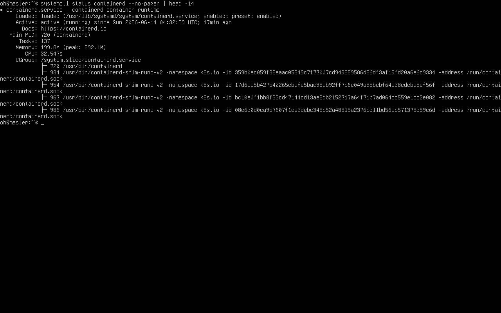
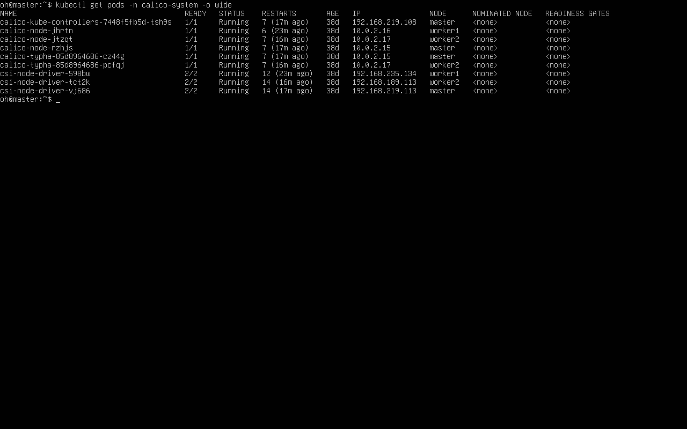
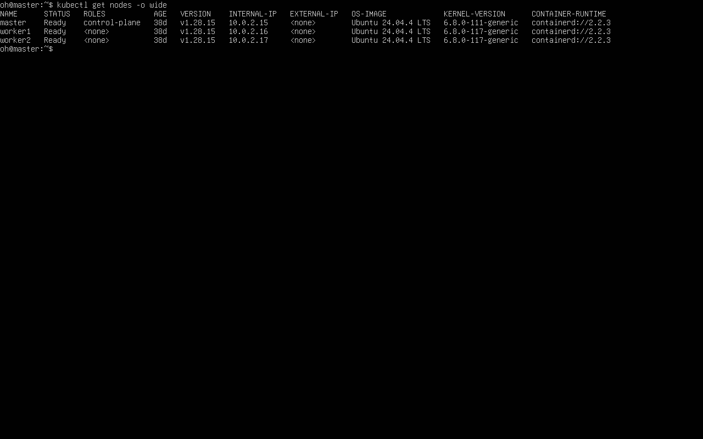

쿠버네티스 첫 주차. 기본 구조를 정리한 뒤 `kubeadm`으로 마스터·워커 2노드 클러스터를 구축하고 다양한 실습 환경을 살펴본다.

## 쿠버네티스 기본 구조

OpenStack은 IaaS로 인프라 자원 자체를 제공하고, 쿠버네티스는 그 위에서 컨테이너를 어디에 띄우고 어떻게 관리할지를 담당하는 컨테이너 오케스트레이션 도구다.

- **클러스터**: 컨테이너를 실행하는 노드(서버)의 모음.
- **노드**: 클러스터를 구성하는 서버 한 대. control plane(master)은 클러스터를 제어하고, worker는 컨테이너를 구동한다.
- **파드**: 최소 컴퓨팅 단위. 보통 컨테이너 1개를 감싸며 자체 가상 IP를 가진다.

구성 도구는 클러스터 생성/관리 `kubeadm`, 노드 에이전트 `kubelet`, 명령행 `kubectl`, 파드 간 네트워크 CNI(Calico)다.


*▲ 로컬 환경에서 직접 확인한 실습 도구 버전 — Docker · kubectl · kind · Python.*

## kubeadm 클러스터 구축

VM을 복제해 master·worker1 두 대를 준비하고, 두 노드에 공통 설정을 한 뒤 마스터를 초기화하는 순서.

### 단계 1 — 호스트 이름 등록

두 노드가 이름으로 서로를 찾도록 `/etc/hosts`에 등록.

```bash
sudo vim /etc/hosts
# 아래 두 줄 추가
# 210.117.212.111 master
# 210.117.212.80  worker1
```

### 단계 2 — 커널 모듈과 sysctl

네트워킹에 필요한 모듈을 로드하고 sysctl 값을 설정.

```bash
cat <<EOF | sudo tee /etc/modules-load.d/k8s.conf
overlay
br_netfilter
EOF
sudo modprobe overlay
sudo modprobe br_netfilter

cat <<EOF | sudo tee /etc/sysctl.d/k8s.conf
net.bridge.bridge-nf-call-iptables = 1
net.bridge.bridge-nf-call-ip6tables = 1
net.ipv4.ip_forward = 1
EOF
sudo sysctl --system
```

### 단계 3 — 도커와 containerd 설정

도커(containerd 포함)를 설치하고 cgroup 드라이버를 systemd로 맞춤. 빠지면 kubelet과 충돌.

```bash
sudo apt-get install docker-ce docker-ce-cli containerd.io docker-buildx-plugin docker-compose-plugin
# 기본 설정 파일 생성
containerd config default | sudo tee /etc/containerd/config.toml > /dev/null
sudo vim /etc/containerd/config.toml
# SystemdCgroup = true 로 수정
sudo systemctl restart containerd
sudo systemctl enable containerd
sudo systemctl status containerd
```


*▲ master 노드 `systemctl status containerd` — `active (running)`, 컨테이너 런타임 정상 동작.*

### 단계 4 — swap 끄기와 방화벽 비활성화

kubelet은 swap이 켜져 있으면 동작을 거부. swap을 끄고 `/etc/fstab`에서도 제거한 뒤 방화벽 비활성화.

```bash
sudo -i
swapoff --all
free -h
vim /etc/fstab     # swap 항목 주석 처리
sudo ufw disable
shutdown -r now
```

### 단계 5 — 쿠버네티스 설치

v1.28 저장소를 등록해 세 도구를 설치하고 `apt-mark hold`로 버전 고정.

```bash
sudo apt-get install -y kubelet kubeadm kubectl
# 자동 업그레이드로 버전이 어긋나는 것을 막는다
sudo apt-mark hold kubelet kubeadm kubectl
sudo systemctl enable --now kubelet.service
```

### 단계 6 — 마스터 노드 초기화

이미지를 미리 받고 `kubeadm init`으로 control plane 구성. CRI 소켓과 파드 네트워크 대역 명시.

```bash
kubeadm config images pull --cri-socket /run/containerd/containerd.sock
kubeadm init \
  --apiserver-advertise-address=210.117.212.111 \
  --pod-network-cidr=192.168.0.0/16 \
  --cri-socket /run/containerd/containerd.sock
# 초기화에 실패하면 정리 후 다시 시도
# sudo kubeadm reset cleanup-node
# sudo systemctl restart kubelet
```

!!! capture "kubeadm init 출력의 join 명령"
    (실습 화면 캡처)

### 단계 7 — kubeconfig 복사

일반 사용자가 `kubectl`을 쓸 수 있도록 kubeconfig 복사.

```bash
mkdir -p $HOME/.kube
sudo cp -i /etc/kubernetes/admin.conf $HOME/.kube/config
sudo chown $(id -u):$(id -g) $HOME/.kube/config
```

### 단계 8 — CNI(Calico) 설치

초기화 직후 노드는 `NotReady`. CNI가 없기 때문. Calico 설치 후 노드가 `Ready`로 바뀜.

```bash
kubectl create -f https://raw.githubusercontent.com/projectcalico/calico/v3.28.1/manifests/tigera-operator.yaml
wget https://raw.githubusercontent.com/projectcalico/calico/v3.28.1/manifests/custom-resources.yaml
kubectl create -f custom-resources.yaml
# 파드가 모두 Running이 될 때까지 지켜본다
watch kubectl get pods -n calico-system
kubectl get node -o wide
```


*▲ `kubectl get pods -n calico-system -o wide` — calico-node·typha·csi 파드가 세 노드에서 Running(CNI 정상).*

### 워커 노드 join

워커에 kubeconfig를 복사하고, 마스터가 출력한 `join` 명령으로 합류. 토큰 만료 시 마스터에서 재발급.

```bash
# 워커 노드에서
mkdir -p $HOME/.kube
scp -p ubuntu@210.117.212.111:~/.kube/config ~/.kube/config
sudo -i
kubeadm join 210.117.212.111:6443 \
  --token <토큰> \
  --discovery-token-ca-cert-hash sha256:<해시> \
  --cri-socket /run/containerd/containerd.sock
```

```bash
# 마스터에서: 토큰 만료 시 join 명령 재발급
kubeadm token create --print-join-command
```

마스터에서 노드 목록 확인. master·worker1이 모두 `Ready`면 완료.

```bash
kubectl get nodes
```


*▲ VirtualBox에 직접 구축한 3노드 kubeadm 클러스터(v1.28.15)에서 `kubectl get nodes -o wide` — master·worker1·worker2 모두 Ready, 런타임 containerd.*

## 다양한 환경에서의 쿠버네티스

`kubeadm` 직접 구축 외에 목적에 따라 선택지가 있다. 웹 플레이그라운드(카타코다, Play with Kubernetes), 로컬/경량(도커 데스크톱, Rancher Desktop, K3s, Vagrant), 매니지드(AWS EKS, Azure AKS).

### kubectl 설치

어떤 환경이든 클러스터를 다루는 도구는 `kubectl`.

```bash
# macOS
brew install kubernetes-cli
# 윈도우
choco install kubernetes-cli
# 리눅스 (바이너리 직접 설치)
curl -Lo ./kubectl https://storage.googleapis.com/kubernetes-release/release/v1.18.8/bin/linux/amd64/kubectl
chmod +x ./kubectl
sudo mv ./kubectl /usr/local/bin/kubectl
```

### 경량 — K3s

도커와 연동되는 경량 배포판. 한 줄로 설치하며 traefik을 끄고 kubeconfig 권한 지정.

```bash
curl -sfL https://get.k3s.io | sh -s - --docker --disable=traefik --write-kubeconfig-mode=644
```

### 매니지드 — AKS / EKS

명령 몇 줄로 단일 노드 클러스터 생성. EKS는 `eksctl`로 만든다. 단일 노드라도 시간당 과금되므로 실습 후 삭제.

```bash
# Azure AKS
az aks create --resource-group kiamol --name kiamol-aks --node-count 1 \
  --node-vm-size Standard_DS2_v2 --kubernetes-version 1.18.8 --generate-ssh-keys
az aks get-credentials --resource-group kiamol --name kiamol-aks
```

어떤 방법으로 만들었든 생성된 클러스터는 동일하게 동작하므로 확인은 같다.

```bash
kubectl get nodes
```

## 막혔던 점

- `kubeadm init` preflight 실패 → `sudo kubeadm reset cleanup-node` 후 `systemctl restart kubelet`, 다시 `init`.
- kubelet이 계속 죽음 → swap 때문. `swapoff --all` + `/etc/fstab` swap 항목 주석 처리.
- 파드 Pending / 노드 NotReady → CNI 미설치 또는 대역 불일치. `--pod-network-cidr=192.168.0.0/16`에 맞춰 Calico 설치.
- containerd cgroup 오류 → `/etc/containerd/config.toml`에서 `SystemdCgroup = true`로 수정 후 재시작.
- `kubectl` connection refused → `admin.conf`를 `$HOME/.kube/config`로 복사, 소유권 변경.
- join 토큰 만료(24시간) → 마스터에서 `kubeadm token create --print-join-command`로 재발급.
