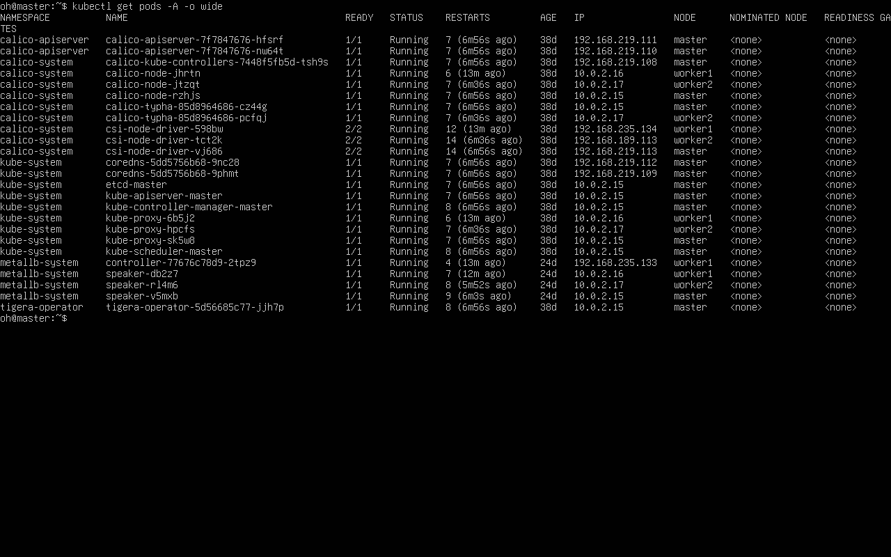
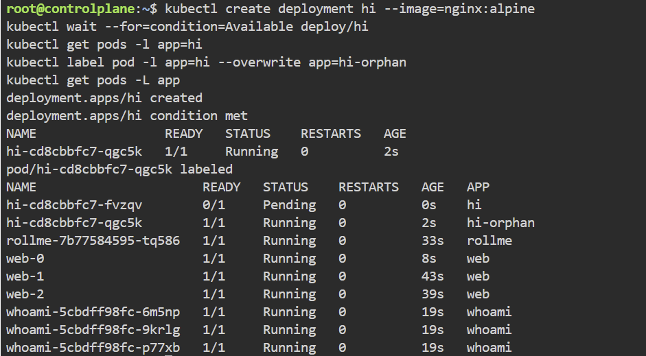
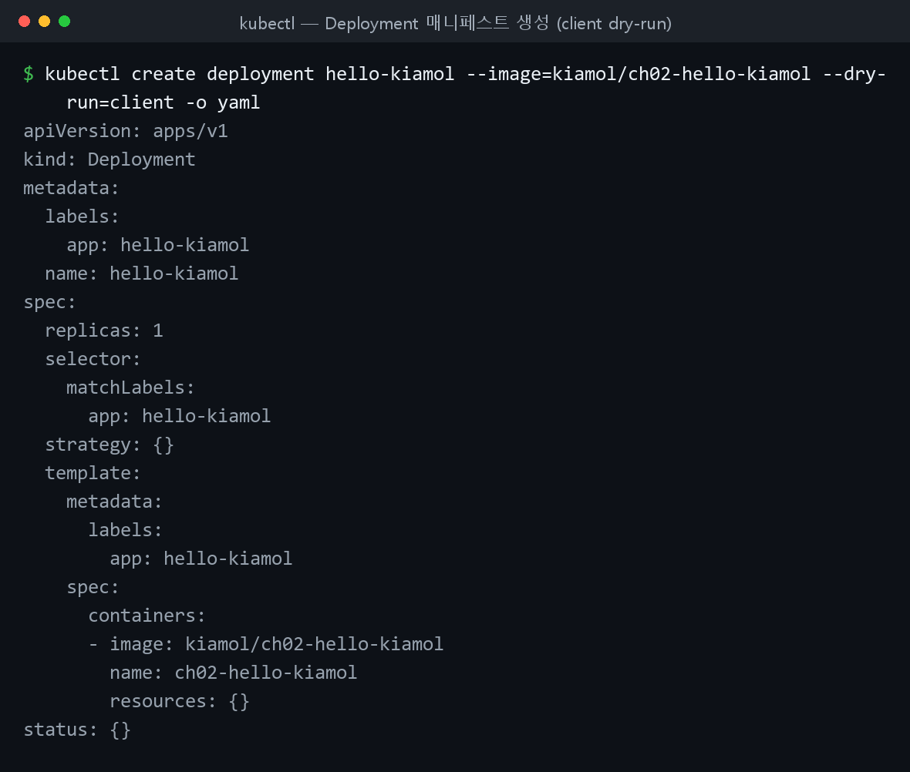
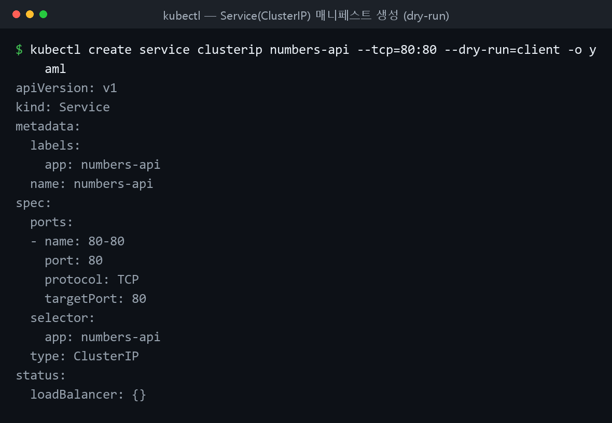
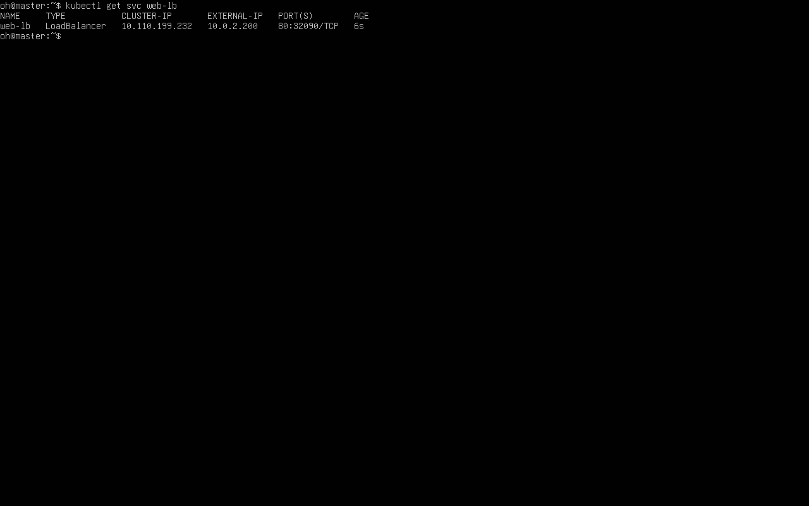
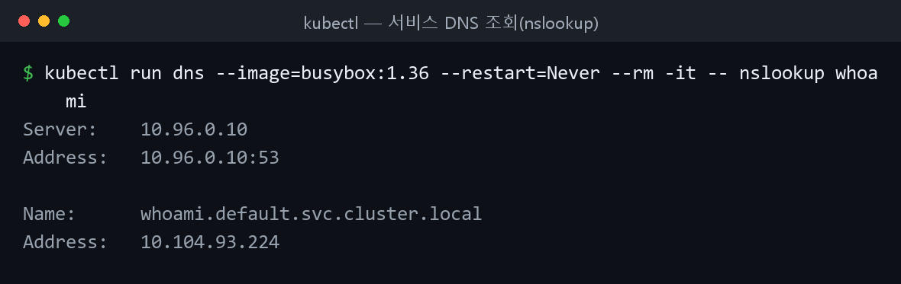

쿠버네티스 초급. 파드 실행 → 디플로이먼트(컨트롤러) → 매니페스트(YAML) 선언적 배포 → 서비스로 통신 순서로 실습한다.

## 파드 실행

컨테이너는 단독으로 동작하지 않고 **파드(Pod)** 에 담겨 동작한다. 간단한 파드는 명령행에서 바로 실행한다.

```bash
kubectl run hello-kiamol --image=kiamol/ch02-hello-kiamol  # 파드 하나 실행
kubectl wait --for=condition=Ready pod hello-kiamol         # 준비 상태 대기
kubectl get pods                                            # 파드 목록
kubectl describe pod hello-kiamol                           # 상세 정보
```

출력 형식은 커스터마이징할 수 있다.

```bash
# 원하는 열만 출력
kubectl get pod hello-kiamol --output custom-columns=NAME:metadata.name,NODE_IP:status.hostIP,POD_IP:status.podIP
# JSONPath로 특정 항목만 출력
kubectl get pod hello-kiamol -o jsonpath='{.status.containerStatuses[0].containerID}'
```


*▲ 직접 구축한 클러스터의 `kubectl get pods -A -o wide` — Calico·CoreDNS·MetalLB 등 시스템 파드가 세 노드에 분산되어 Running.*

### 자가치유

쿠버네티스는 파드에 필요한 컨테이너 개수를 유지한다. 컨테이너를 직접 지워도 대체 컨테이너가 생성된다.

```bash
# 파드에 포함된 컨테이너를 강제 삭제
docker container rm -f $(docker container ls -q --filter label=io.kubernetes.container.name=hello-kiamol)
kubectl get pod hello-kiamol   # 컨테이너가 다시 생성됨
```

### 포트포워딩

`kubectl port-forward` 는 로컬 포트로 들어온 트래픽을 파드 포트로 임시 전달한다(디버깅용).

```bash
kubectl port-forward pod/hello-kiamol 8080:80  # 로컬 8080 → 파드 80, ctrl-c로 중단
```

!!! capture "port-forward 후 브라우저 화면"
    (http://localhost:8080 의 hello-kiamol 페이지 캡처)

## 디플로이먼트

디플로이먼트는 파드를 관리하는 컨트롤러 객체다. 현재 상태가 바람직한 상태와 다르면 자동으로 보정한다(노드 고장 시 대체 파드 실행 등).

```bash
kubectl create deployment hello-kiamol-2 --image=kiamol/ch02-hello-kiamol  # 디플로이먼트 생성
kubectl get pods
```

디플로이먼트는 관리 대상 파드에 **레이블** 을 부여하고 **레이블 셀렉터** 로 식별한다.

```bash
# 디플로이먼트가 부여한 레이블 출력
kubectl get deploy hello-kiamol-2 -o jsonpath='{.spec.template.metadata.labels}'
kubectl get pods -l app=hello-kiamol-2   # 해당 레이블 파드 목록
```

파드 레이블을 셀렉터와 다르게 바꾸면 컨트롤러가 관리 대상에서 제외하고 부족분을 채우려 파드를 하나 더 만든다.

```bash
kubectl label pods -l app=hello-kiamol-2 --overwrite app=hello-kiamol-x   # 레이블 변경 → 파드 추가됨
kubectl get pods -o custom-columns=NAME:metadata.name,LABELS:metadata.labels
kubectl label pods -l app=hello-kiamol-x --overwrite app=hello-kiamol-2   # 원복 → 여분 정리
kubectl port-forward deploy/hello-kiamol-2 8080:80                        # 디플로이먼트에도 포트포워딩
```


*▲ 파드 하나의 레이블을 바꿔 디플로이먼트 관리 대상에서 빼면(app=hi-orphan), 컨트롤러가 즉시 새 파드를 하나 더 만든다.*

## 매니페스트로 배포

매니페스트는 주로 **YAML** 로 쓰며 `apiVersion` 과 `kind` 로 시작한다. `--dry-run=client -o yaml` 로 골격을 생성할 수 있다.


*▲ `kubectl create deployment ... --dry-run=client -o yaml` 로 디플로이먼트 매니페스트를 직접 생성해 본 결과(로컬 실행). `apiVersion`·`kind`·`spec.selector`·`template` 구조가 한눈에 보인다.*

`pod.yaml` — 컨테이너 하나를 실행하는 단일 파드.

```yaml
apiVersion: v1
kind: Pod
metadata:
  name: hello-kiamol-3       # 이름은 필수, 레이블은 선택
spec:
  containers:                # 파드는 실행할 컨테이너를 정의해야 한다
    - name: web              # 컨테이너는 이름과 이미지로 정의된다
      image: kiamol/ch02-hello-kiamol
```

`kubectl apply -f` 로 적용한다. 로컬 파일과 원격 URL 모두 가능하다.

```bash
kubectl apply -f pod.yaml   # 로컬 매니페스트로 배포
kubectl get pods
# 원격 URL 매니페스트로 바로 배포
kubectl apply -f https://raw.githubusercontent.com/sixeyed/kiamol/master/ch02/pod.yaml
```

`deployment.yaml` — `apps/v1` API. 셀렉터(`spec.selector.matchLabels`)와 파드 템플릿(`spec.template`)을 정의한다.

```yaml
apiVersion: apps/v1
kind: Deployment
metadata:
  name: hello-kiamol-4
spec:
  selector:                  # 디플로이먼트가 관리 대상을 찾는 셀렉터
    matchLabels:
      app: hello-kiamol-4
  template:                  # 파드를 만들 때 쓰는 템플릿
    metadata:
      labels:
        app: hello-kiamol-4  # 셀렉터와 일치하는 레이블이어야 한다
    spec:
      containers:
        - name: web
          image: kiamol/ch02-hello-kiamol
```

!!! warning "셀렉터와 템플릿 레이블은 반드시 일치해야 한다"
    `spec.selector.matchLabels` 와 `spec.template.metadata.labels` 가 다르면 컨트롤러가 자기 파드를 인식하지 못한다.

```bash
kubectl apply -f deployment.yaml         # 디플로이먼트 실행
kubectl get pods -l app=hello-kiamol-4   # 만들어진 파드 확인
```

컨트롤러가 만든 리소스는 직접 지워도 컨트롤러가 다시 만든다. 정말 없애려면 컨트롤러를 삭제한다.

```bash
kubectl delete pods --all     # 파드 전체 삭제해도
kubectl get pods              # 디플로이먼트가 되살림
kubectl delete deploy --all   # 컨트롤러를 삭제해야 제거됨
kubectl get all
```

## 서비스로 통신

파드 IP는 파드가 대체될 때마다 바뀐다. 서비스(Service)는 고정 도메인 네임을 제공해 이 문제를 푼다(어드레스 디스커버리). 서비스 이름은 클러스터 내부 DNS에 등록된다.


*▲ `kubectl create service clusterip ... --dry-run=client -o yaml` 로 생성한 ClusterIP 서비스 매니페스트(로컬 실행). `spec.selector` 와 `ports` 로 어떤 파드에 어떤 포트로 연결할지 정의한다.*

파드 IP가 바뀌는 것부터 두 sleep 디플로이먼트로 확인한다.

```bash
cd ch03
kubectl apply -f sleep/sleep1.yaml -f sleep/sleep2.yaml   # 디플로이먼트 둘 생성
kubectl wait --for=condition=Ready pod -l app=sleep-2
# 두 번째 파드 IP 확인 후 그 IP로 ping
kubectl get pod -l app=sleep-2 --output jsonpath='{.items[0].status.podIP}'
kubectl exec deploy/sleep-1 -- ping -c 2 $(kubectl get pod -l app=sleep-2 --output jsonpath='{.items[0].status.podIP}')
kubectl delete pods -l app=sleep-2                        # 파드 대체 → IP가 바뀐다
kubectl get pod -l app=sleep-2 --output jsonpath='{.items[0].status.podIP}'
```

`sleep2-service.yaml` — 기본 유형인 **ClusterIP** 서비스. 클러스터 내부에서만 유효한 IP를 부여한다.

```yaml
apiVersion: v1
kind: Service
metadata:
  name: sleep-2          # 서비스 이름이 도메인 네임으로 쓰인다
spec:
  selector:
    app: sleep-2         # app=sleep-2 인 모든 파드가 대상이다
  ports:
    - port: 80           # 80 포트를 주시하다 파드의 80 포트로 전달
```

```bash
kubectl apply -f sleep/sleep2-service.yaml
kubectl get svc sleep-2
kubectl exec deploy/sleep-1 -- ping -c 1 sleep-2   # ping은 막혀도 DNS 이름은 해소됨
```

### 파드 간 통신 — ClusterIP

내부 API를 호출하는 웹 애플리케이션(numbers). API용 서비스가 없으면 Go 버튼이 오류를 낸다.

```bash
kubectl apply -f numbers/api.yaml -f numbers/web.yaml   # 웹·API 디플로이먼트 실행
kubectl wait --for=condition=Ready pod -l app=numbers-web
kubectl port-forward deploy/numbers-web 8080:80          # http://localhost:8080, Go 버튼 → 오류
```

`api-service.yaml` 로 API용 ClusterIP 서비스를 배포하면 웹이 서비스 이름으로 API를 찾으므로 API 파드가 대체돼도 정상 동작한다.

```yaml
apiVersion: v1
kind: Service
metadata:
  name: numbers-api
spec:
  ports:
    - port: 80
  selector:
    app: numbers-api
  type: ClusterIP
```

!!! capture "Go 버튼 정상 동작 화면"
    (API 서비스 배포 후 무작위 숫자가 출력되는 화면 캡처)

### 외부 트래픽 — LoadBalancer

외부 트래픽을 파드로 전달하려면 **LoadBalancer** 서비스를 쓴다. 외부 EXTERNAL-IP로 접근한다.

```yaml
apiVersion: v1
kind: Service
metadata:
  name: numbers-web
spec:
  ports:
    - port: 8080       # 서비스가 주시하는 포트
      targetPort: 80   # 트래픽이 전달될 파드의 포트
  selector:
    app: numbers-web
  type: LoadBalancer
```

```bash
kubectl apply -f numbers/web-service.yaml   # 방화벽 허용을 물으면 허용
kubectl get svc numbers-web
# EXTERNAL-IP로 애플리케이션 URL 출력
kubectl get svc numbers-web -o jsonpath='http://{.status.loadBalancer.ingress[0].*}:8080'
```


*▲ LoadBalancer 서비스에 MetalLB가 `EXTERNAL-IP 10.0.2.200` 을 할당 — 클러스터 외부에서 이 주소로 접근 가능.*

### ExternalName과 헤드리스

클러스터 외부 컴포넌트는 **ExternalName** 서비스로 로컬 이름을 외부 도메인(CNAME)에 연결한다.

```yaml
apiVersion: v1
kind: Service
metadata:
  name: numbers-api
spec:
  type: ExternalName
  externalName: raw.githubusercontent.com   # 로컬 이름을 해소할 외부 도메인
```

```bash
kubectl delete svc numbers-api
kubectl apply -f numbers-services/api-service-externalName.yaml
kubectl exec deploy/sleep-1 -- sh -c 'nslookup numbers-api | tail -n 5'   # CNAME 연결 확인
```

`selector` 없이 **Endpoints** 에 정적 IP를 직접 적으면 **헤드리스 서비스** 가 된다.

```yaml
apiVersion: v1
kind: Service
metadata:
  name: numbers-api
spec:
  type: ClusterIP
  ports:                # selector 가 없으므로 헤드리스 서비스
    - port: 80
---
kind: Endpoints
apiVersion: v1
metadata:
  name: numbers-api
subsets:
  - addresses:          # 정적 IP 주소 목록
      - ip: 192.168.123.234
    ports:
      - port: 80
```

```bash
kubectl apply -f numbers-services/api-service-headless.yaml
kubectl get svc numbers-api
kubectl get endpoints numbers-api
```

### 엔드포인트와 네임스페이스

엔드포인트(Endpoints)는 서비스가 가리키는 파드 IP 목록이며, 파드가 대체되면 자동 갱신된다.

```bash
kubectl get endpoints sleep-2
kubectl delete pods -l app=sleep-2   # 엔드포인트가 새 IP로 갱신됨
kubectl get endpoints sleep-2
```

네임스페이스는 클러스터를 논리적으로 분할한다. `-n` 으로 대상을 지정하며, FQDN은 `서비스.네임스페이스.svc.cluster.local` 형태다. 내부 DNS는 `kube-system` 의 kube-dns가 담당한다.

```bash
kubectl get svc -n kube-system
# FQDN으로 DNS 조회
kubectl exec deploy/sleep-1 -- sh -c 'nslookup numbers-api.default.svc.cluster.local | grep "^[^*]"'
```


*▲ 클러스터 내부 DNS가 서비스 이름 `whoami` 를 ClusterIP(10.104.93.224)로 해소한다.*

## 막혔던 점

- 서비스 이름으로 ping 실패 → ClusterIP에서 ICMP는 막힌 경우가 많음. HTTP 요청이나 nslookup으로 검증.
- 파드를 지워도 되살아남 → 디플로이먼트의 관리 대상이라 그렇다. `kubectl delete deploy ...` 로 컨트롤러를 삭제.
- 레이블을 바꿨더니 파드 추가 → 셀렉터 불일치로 관리 제외됨. 레이블 원복으로 정리.
- Go 버튼 오류 → api-service 미배포로 이름 해소 실패. API용 ClusterIP 배포로 해결.
- LoadBalancer EXTERNAL-IP `<pending>` → 플랫폼에 따라 제공 방식 다름. 방화벽 허용 후 노드 IP/포트나 NodePort로 대체.
- `delete --all` 은 현재 네임스페이스 전체를 지움 → 실행 전 `-n` 으로 대상 확인.
