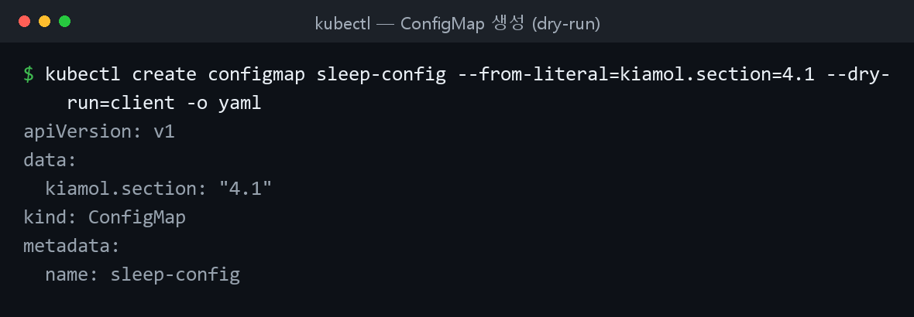
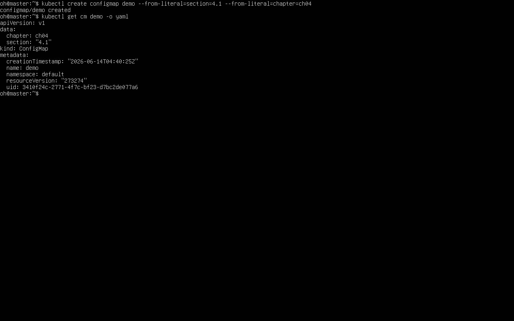

쿠버네티스 중급. 컨피그맵/비밀값으로 설정 주입 → 볼륨·마운트·클레임으로 데이터 보존 → 레플리카셋·디플로이먼트·데몬셋으로 스케일링 순서로 실습했다.

## 컨피그맵과 비밀값

**컨피그맵(ConfigMap)** 과 **비밀값(Secret)** 은 설정을 코드와 분리해 보관하다가 파드로 전달한다. 모든 컨테이너에는 기본 환경 변수가 있다.

```bash
cd ch04
kubectl apply -f sleep/sleep.yaml          # 설정값 없이 sleep 파드 실행
kubectl wait --for=condition=Ready pod -l app=sleep
kubectl exec deploy/sleep -- printenv HOSTNAME KIAMOL_CHAPTER   # 기본 환경 변수 확인
```

### 환경 변수로 주입

`env` 직접 지정, `valueFrom.configMapKeyRef`(특정 항목), `envFrom.configMapRef`(전체)로 끌어올 수 있다. 컨피그맵은 리터럴·env 파일·YAML로 만든다.

```bash
kubectl create configmap sleep-config-literal --from-literal=kiamol.section='4.1'  # 리터럴로 생성
kubectl describe cm sleep-config-literal
kubectl apply -f sleep/sleep-with-configMap-env.yaml                # 참조하도록 파드 재배치
kubectl exec deploy/sleep -- sh -c 'printenv | grep "^KIAMOL"'      # 주입 확인
kubectl create configmap sleep-config-env-file --from-env-file=sleep/ch04.env  # env 파일로도 생성
```


*▲ `kubectl create configmap ... --dry-run=client -o yaml` 로 컨피그맵을 생성해 본 결과(로컬 실행). `data` 아래에 키-값으로 설정이 담긴다.*


*▲ 직접 구축한 클러스터에서 `kubectl create configmap` 후 `get cm -o yaml` — `data` 에 키-값 설정이 담긴다.*

### 볼륨 마운트로 설정 파일 주입

컨피그맵을 파일로도 주입할 수 있다. 컨피그맵은 디렉터리, 각 항목은 파일이 된다.

```yaml
apiVersion: v1
kind: ConfigMap
metadata:
  name: todo-web-config-dev
data:
  config.json: |-          # 키 이름이 곧 파일 이름이 된다
    {
      "ConfigController": {
        "Enabled": true
      }
    }
```

파드는 `volumeMounts` + `volumes` 로 마운트한다. `readOnly: true` 로 읽기 전용, `items` 로 특정 항목만 마운트할 수 있다.

```yaml
spec:
  containers:
    - name: web
      image: kiamol/ch04-todo-list
      volumeMounts:
        - name: config
          mountPath: "/app/config"   # 볼륨이 마운트될 경로
          readOnly: true
  volumes:
    - name: config                   # 볼륨 마운트 이름과 일치
      configMap:
        name: todo-web-config-dev
```

```bash
kubectl apply -f todo-list/configMaps/todo-web-config-dev.yaml
kubectl exec deploy/todo-web -- sh -c 'ls -l /app/config/*.json'
# 읽기 전용 검증 - 실패가 정상이다
kubectl exec deploy/todo-web -- sh -c 'echo ch04 >> /app/config/config.json'
```

!!! warning "볼륨 마운트로 주입한 컨피그맵의 갱신은 지연된다"
    볼륨 마운트로 주입한 설정 파일은 반영까지 시간이 걸린다(실습 `sleep 120`). 환경 변수로 주입한 값은 파드를 재배포해야 바뀐다.

!!! capture "읽기 전용 쓰기 실패"
    (읽기 전용 볼륨에 `echo ... >>` 시 권한 오류가 나는 화면 캡처)

## 볼륨·마운트·클레임

컨테이너 파일시스템의 기록 레이어는 컨테이너 생애주기를 따른다. 컨테이너가 재시작되면 기록한 파일이 사라진다.

```bash
cd ch05
kubectl apply -f sleep/sleep.yaml
kubectl exec deploy/sleep -- sh -c 'echo ch05 > /file.txt; ls /*.txt'  # 파일 생성
kubectl exec -it deploy/sleep -- killall5                              # 컨테이너 재시작
kubectl exec deploy/sleep -- ls /*.txt                                 # 파일이 사라짐
```

### emptyDir와 hostPath

emptyDir는 파드에 딸린 빈 디렉터리로, 같은 파드 안에서 컨테이너가 교체돼도 유지된다(파드가 다른 노드로 옮겨가면 소멸).

```yaml
spec:
  containers:
    - name: sleep
      image: kiamol/ch03-sleep
      volumeMounts:
        - name: data
          mountPath: /data
  volumes:
    - name: data
      emptyDir: {}            # 유형은 공디렉터리
```

```bash
kubectl apply -f sleep/sleep-with-emptyDir.yaml
kubectl exec deploy/sleep -- sh -c 'echo ch05 > /data/file.txt; ls /data'
kubectl exec deploy/sleep -- killall5
kubectl exec deploy/sleep -- cat /data/file.txt   # 컨테이너가 바뀌어도 유지됨
```

hostPath는 노드의 디렉터리를 가리킨다. `type: DirectoryOrCreate` 는 없으면 생성한다.

```yaml
volumes:
  - name: cache-volume
    hostPath:
      path: /volumes/nginx/cache
      type: DirectoryOrCreate
```

!!! warning "hostPath 의 path: / 는 보안 위험"
    노드 루트(`path: /`, `type: Directory`)를 통째로 마운트하면 컨테이너가 노드 파일시스템 전체에 접근한다. 필요하면 `subPath` 로 범위를 좁힌다.

```bash
kubectl apply -f pi/nginx-with-hostPath.yaml
kubectl exec deploy/pi-proxy -- ls -l /data/nginx/cache
```

### 영구볼륨(PV)과 영구볼륨클레임(PVC)

클러스터 전체에서 접근 가능한 스토리지는 **PV**(클러스터가 제공)와 **PVC**(애플리케이션이 요청)로 쓴다.

```yaml
apiVersion: v1
kind: PersistentVolume
metadata:
  name: pv01
spec:
  capacity:
    storage: 50Mi             # 볼륨 용량
  accessModes:
    - ReadWriteOnce           # 파드 하나에서만 사용 가능
  nfs:                        # NFS 등 분산 스토리지 사용
    server: nfs.my.network
    path: "/kubernetes-volumes"
---
apiVersion: v1
kind: PersistentVolumeClaim
metadata:
  name: postgres-pvc
spec:
  accessModes:
    - ReadWriteOnce
  resources:
    requests:
      storage: 40Mi           # 요청하는 용량
  storageClassName: ""        # 스토리지 유형 미지정
```

```bash
kubectl apply -f todo-list/persistentVolume.yaml
kubectl get pv
kubectl apply -f todo-list/postgres-persistentVolumeClaim.yaml   # 조건 맞으면 Bound
kubectl get pvc
kubectl apply -f todo-list/postgres-persistentVolumeClaim-too-big.yaml  # 맞는 PV 없으면 Pending
kubectl get pvc
```

PVC를 볼륨으로 쓰는 파드(`persistentVolumeClaim.claimName`)에 PostgreSQL을 올리면 DB 파드를 삭제해도 데이터가 유지된다.

```bash
kubectl apply -f todo-list/postgres/
kubectl delete pod -l app=todo-db   # 파드를 지워도
kubectl exec deploy/sleep -- ls -l /node-root/volumes/pv01/pg_wal   # 데이터는 남아 있다
```

!!! capture "kubectl get pv / pvc (Bound·Pending)"
    (PVC가 Bound 된 모습과 용량이 큰 PVC가 Pending 으로 남는 모습을 함께 캡처)

## 스케일링

컨트롤러는 파드 템플릿으로 동일한 파드의 레플리카를 여러 개 만든다. 스케일링은 파드를 늘리는 것이다.

레플리카셋(ReplicaSet)은 파드를 직접 관리한다. 디플로이먼트는 그 위에 관리 계층을 얹어, 업데이트 시 새 레플리카셋을 만들고 기존 레플리카셋을 0으로 줄여 롤아웃/롤백을 처리한다.

```yaml
apiVersion: apps/v1
kind: ReplicaSet
metadata:
  name: whoami-web
spec:
  replicas: 1
  selector:
    matchLabels:
      app: whoami-web
  template:           # 일반적인 파드 정의가 이어진다
    metadata:
      labels:
        app: whoami-web
```

```bash
cd ch06
kubectl apply -f whoami/
kubectl get replicaset whoami-web
kubectl delete pods -l app=whoami-web              # 레플리카셋이 대체 파드 생성
kubectl apply -f whoami/update/whoami-replicas-3.yaml  # 레플리카 3으로 증가
# 서비스로 여러 번 요청해 로드밸런싱 확인
kubectl exec deploy/sleep -- sh -c 'for i in 1 2 3; do curl -w "\n" -s http://whoami-web:8088; done;'
```

!!! capture "로드밸런싱 응답"
    (같은 서비스에 여러 번 요청했을 때 서로 다른 파드 호스트 이름이 응답하는 출력 캡처)

### kubectl scale vs apply

`kubectl scale` 은 즉석 변경이며, 이후 `apply` 하면 매니페스트 값으로 원복된다. `--show-labels` 로 파드와 레플리카셋이 `pod-template-hash` 로 묶임을 확인한다.

```bash
kubectl get rs -l app=pi-web
kubectl scale --replicas=4 deploy/pi-web              # 즉석 스케일
kubectl apply -f pi/web/update/web-replicas-3.yaml    # 매니페스트 값(3)으로 원복
kubectl get rs -l app=pi-web --show-labels
```

### 데몬셋

데몬셋(DaemonSet)은 모든 노드(또는 셀렉터 일치 노드)에서 노드당 파드 하나를 동작시킨다. 로그·지표 수집 같은 인프라성 작업에 적합하다.

```yaml
apiVersion: apps/v1
kind: DaemonSet
metadata:
  name: pi-proxy
spec:
  selector:
    matchLabels:
      app: pi-proxy
  template:
    metadata:
      labels:
        app: pi-proxy
    spec:
      # ... 파드 정의 ...
      nodeSelector:        # 특정 노드에서만 실행
        kiamol: ch06
```

```bash
kubectl apply -f pi/proxy/daemonset/nginx-ds.yaml
kubectl delete deploy pi-proxy            # 디플로이먼트를 데몬셋으로 교체
kubectl get daemonset pi-proxy
kubectl delete ds pi-proxy --cascade=false  # 관리 대상 파드는 남기고 데몬셋만 삭제
```

!!! capture "kubectl get ds"
    (DESIRED/CURRENT/READY 수가 노드 수와 일치하는 화면 캡처)

## 막혔던 점

- 컨피그맵 수정이 반영 안 됨 → 볼륨 마운트는 지연 반영(잠시 대기), 환경 변수는 파드 재배포(`apply`) 필요.
- 읽기 전용 볼륨 쓰기 실패 → `readOnly: true` 의 의도된 동작. 실패가 정상.
- 재시작/파드 삭제 후 파일 소멸 → 컨테이너 재시작은 emptyDir, 파드·노드 교체는 PV/PVC로 보존.
- PVC가 Pending → 요청 용량·accessModes에 맞는 PV가 없을 때. 용량을 PV capacity 이하로 맞춤. too-big PVC의 Pending은 정상.
- PV 디렉터리 없어 DB 실패 → hostPath sleep 파드로 `mkdir -p /node-root/volumes/pv01` 선행 후 배치.
- scale이 apply 후 원복 / 데몬셋 파드 0개 → 영구 변경은 매니페스트 replicas 수정. 데몬셋은 `kubectl label node ... kiamol=ch06` 로 셀렉터 일치.
