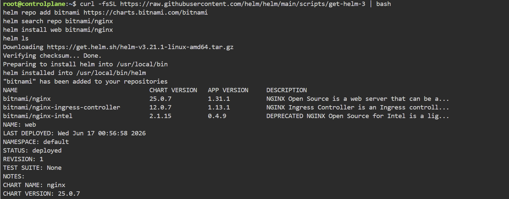

헬름 패키징 → 개발 워크플로(도커 vs 쿠버네티스) → 자기수복(프로브·원자적 업그레이드) 순서로 실습했다.

## 헬름으로 애플리케이션 패키징

헬름은 여러 YAML을 차트로 묶는 쿠버네티스 패키지 관리자다. 차트를 클러스터에 설치한 인스턴스가 릴리스이고, 템플릿 변수(`{{ }}`)는 설치 시점에 값으로 치환된다.

```bash
choco install -y kubernetes-helm        # 헬름 설치(윈도우)
helm version                            # 설치 확인
helm repo add kiamol https://kiamol.net # 원격 리포 추가
helm repo update                        # 캐시 업데이트
helm search repo vweb --versions        # 차트 검색
```

!!! capture "helm search repo 결과"
    (실습 화면 캡처)

`helm show values`로 파라미터를 확인하고 `--set`으로 값을 바꿔 설치한다. `helm upgrade`로 업데이트:

```bash
helm show values kiamol/vweb --version 1.0.0  # 파라미터 기본값
helm install --set servicePort=8010 --set replicaCount=1 ch10-vweb kiamol/vweb --version 1.0.0  # 설치
helm ls                                                                                          # 릴리스 확인
helm upgrade --set servicePort=8010 --set replicaCount=3 ch10-vweb kiamol/vweb --version 1.0.0  # 업데이트
```


*▲ Helm을 설치하고 차트 저장소 추가·검색(`helm search`) 후 `helm install` 로 배포 — STATUS: deployed.*

차트는 매니페스트 디렉터리이고, 설정값 자리를 템플릿 변수로 둔다. `web-ping` 차트의 디플로이먼트:

```yaml
apiVersion: apps/v1
kind: Deployment
metadata:
  name: {{ .Release.Name }}                # 릴리스 이름이 들어갈 템플릿 변수
spec:
  containers:
    - name: app
      image: kiamol/ch10-web-ping
      env:
        - name: TARGET
          value: {{ .Values.targetUrl }}
        - name: INTERVAL
          value: {{ .Values.pingIntervalMilliseconds | quote }}
```

```bash
cd ch10
helm lint web-ping                                  # 차트 유효성 검증
helm install wp1 web-ping/                           # 차트 디렉터리에서 설치
helm install --set targetUrl=kiamol.net wp2 web-ping/  # 값을 달리한 릴리스
```

차트를 공유하려면 리포지터리가 필요하다. 차트뮤지엄을 비공개 리포로 띄우고 패키징한 차트를 업로드:

```bash
helm repo add stable https://charts.helm.sh/stable  # 공식 헬름 리포
# 차트뮤지엄 설치
helm install --set service.type=LoadBalancer --set service.externalPort=8008 --set env.open.DISABLE_API=false repo stable/chartmuseum --version 2.13.0 --wait
helm package web-ping                                # 차트 패키징
# 패키징된 차트 업로드
curl --data-binary "@web-ping-0.1.0.tgz" $(kubectl get svc repo-chartmuseum -o jsonpath='http://{.status.loadBalancer.ingress[0].*}:8008/api/charts')
helm install -f web-ping-values.yaml wp3 local/web-ping  # 설정 파일로 로컬 리포 차트 설치
```

!!! capture "차트뮤지엄 업로드 결과"
    (실습 화면 캡처)

의존 차트는 `condition`으로 켜고 끈다. 상위 차트(`pi`)가 하위 차트(`vweb`, `proxy`)를 참조하되 프록시는 필요할 때만 설치:

```yaml
apiVersion: v2
name: pi
version: 0.1.0
dependencies:                         # 이 차트가 의존하는 다른 차트
  - name: vweb
    version: 2.0.0
    repository: https://kiamol.net    # 차트 출처가 리포지터리
    condition: vweb.enabled           # 필요할 때만 설치
  - name: proxy
    version: 0.1.0
    repository: file://../proxy       # 로컬 디렉터리에 있는 차트
    condition: proxy.enabled          # 필요할 때만 설치
```

```bash
helm dependency build pi                            # 하위 차트 빌드(내려받기)
helm install pi1 ./pi --dry-run                     # 오류 여부 검증
helm install --set serviceType=ClusterIP --set proxy.enabled=true pi2 ./pi  # 프록시 포함 설치
```

## 개발 워크플로 — 도커 vs 쿠버네티스

도커 워크플로는 내부 주기에 도커가 깊이 관여하고, 쿠버네티스 워크플로는 내부 주기에서 도커를 빼고 외부 주기(클러스터 빌드)에서만 컨테이너를 쓴다.

도커 워크플로 — 로컬에서 빌드·실행하고 같은 이미지를 쿠버네티스에 배치. 로컬 이미지를 쓰도록 `imagePullPolicy: IfNotPresent` 지정:

```bash
cd ch11
docker-compose -f bulletin-board/docker-compose.yml build  # 빌드
docker-compose -f bulletin-board/docker-compose.yml up -d   # 실행
kubectl apply -f bulletin-board/kubernetes/                 # 클러스터에 배치
# 소스 수정 후 재빌드 → 파드 삭제로 새 버전 교체
docker-compose -f bulletin-board/docker-compose.yml build
kubectl delete pod -l app=bulletin-board
```

쿠버네티스 워크플로 — 로컬에서 도커를 배제하고 커밋하면 클러스터가 빌드한다. 깃 서버 Gogs와 BuildKit+buildpacks를 클러스터에 띄운다:

```bash
kubectl apply -f infrastructure/gogs.yaml                   # 깃 서버 배치
git push gogs                                               # 코드 푸시
kubectl apply -f infrastructure/buildkitd.yaml             # BuildKit 배치
kubectl exec deploy/buildkitd -- sh -c 'git version && buildctl --version'  # 도구 확인
# Dockerfile 없이 buildpacks로 빌드
buildctl build --frontend=gateway.v0 --opt source=kiamol/buildkit-buildpacks --local context=src --output type=image,name=kiamol/ch11-bulletin-board:buildkit
```

네임스페이스는 리소스를 묶는 단위로, 삭제하면 소속 리소스도 함께 삭제된다. 컨텍스트는 접속 클러스터와 기본 네임스페이스를 묶은 것이다:

```bash
kubectl create namespace kiamol-ch11-test                  # 네임스페이스 생성
kubectl apply -f sleep.yaml --namespace kiamol-ch11-test   # 그 안에 배치
kubectl config set-context --current --namespace=kiamol-ch11-test  # 기본 네임스페이스 변경
kubectl config view                                        # 접속 설정 확인
kubectl delete namespace kiamol-ch11-uat                   # 삭제 → 소속 리소스도 삭제
```

!!! warning "네임스페이스 삭제는 곧 일괄 삭제"
    `kubectl delete namespace`는 그 안의 모든 리소스를 한꺼번에 지운다. 삭제 전 `kubectl get all -n <네임스페이스>`로 내용을 확인한다.

## 자기수복형 애플리케이션

쿠버네티스는 컨테이너 실행 여부는 알지만 내부 애플리케이션 정상 여부는 모른다. 컨테이너 프로브로 이를 검사한다. 레디니스 실패 시 서비스 엔드포인트에서 제외, 리브니스 실패 시 컨테이너 재시작이다.

`numbers-api`는 몇 번 호출하면 고장 나는 앱이다. 레디니스 프로브를 붙이면 고장 난 파드가 엔드포인트에서 빠진다:

```yaml
spec:
  containers:
    - image: kiamol/ch03-numbers-api
      readinessProbe:                 # 프로브는 컨테이너 수준에서 정의된다
        httpGet:
          path: /healthz              # 이 URL에 HTTP GET 요청을 보낸다
          port: 80
        periodSeconds: 5              # 5초에 한 번씩 상태를 확인한다
```

```bash
cd ch12
kubectl apply -f numbers/                                  # API 배치
kubectl get endpoints numbers-api                          # 엔드포인트 포함 확인
kubectl apply -f numbers/update/api-with-readiness.yaml    # 레디니스 프로브 적용
curl "$(cat api-url.txt)/rng"                              # 호출해 고장 유발
kubectl get endpoints numbers-api                          # 엔드포인트에서 제외 확인
```

!!! capture "get endpoints — 레디니스로 제외"
    (실습 화면 캡처)

리브니스 프로브를 더하면 고장 난 파드가 재시작된다. `initialDelaySeconds`로 첫 체크를 늦추고 `failureThreshold`로 실패 허용 횟수를 정한다:

```yaml
livenessProbe:
  httpGet:                   # 레디니스 프로브와 마찬가지로
    path: /healthz           # HTTP GET 요청으로 상태를 체크
    port: 80
  periodSeconds: 10
  initialDelaySeconds: 10    # 첫 번째 상태 체크 전 10초 대기
  failureThreshold: 2        # 상태 체크 실패 두 번까지는 용인
```

```bash
kubectl apply -f numbers/update/api-with-readiness-and-liveness.yaml  # 레디니스+리브니스 적용
curl "$(cat api-url.txt)/rng"                                         # 고장 유발
kubectl get pods -l app=numbers-api                                   # RESTARTS 증가 확인
```

!!! capture "리브니스로 파드 재시작"
    (실습 화면 캡처)

비-HTTP 컴포넌트는 다른 방식을 쓴다. PostgreSQL은 레디니스에 포트 확인(`tcpSocket`), 리브니스에 명령 실행(`exec`)을 둔다:

```yaml
readinessProbe:
  tcpSocket:
    port: 5432             # DB가 이 포트를 주시하는지 체크
  periodSeconds: 5
livenessProbe:
  exec:                    # 명령행 도구를 실행하여 동작 여부 체크
    command: ["pg_isready", "-h", "localhost"]
  periodSeconds: 10
  initialDelaySeconds: 10
```

헬름 `--atomic`은 설치·업그레이드 실패 시 자동으로 이전 상태로 롤백한다:

```bash
helm install --atomic todo-list todo-list/helm/v1/todo-list/                # 원자적 설치
helm upgrade --atomic --timeout 30s todo-list todo-list/helm/v2/todo-list/  # 잘못된 업그레이드 → 자동 롤백
# 이미지가 롤백으로 그대로인지 확인
kubectl get pods -l app=todo-list-db -o=custom-columns=NAME:.metadata.name,STATUS:.status.phase,IMAGE:.spec.containers[0].image
```

헬름 훅으로 생애 주기 특정 시점에 작업을 끼운다. `helm.sh/hook: test`는 설치 후 스모크 테스트를 실행:

```yaml
apiVersion: batch/v1
kind: Job                  # 잡 정의
metadata:
  annotations:
    "helm.sh/hook": test   # 헬름 test로 실행할 잡임을 명기
spec:
  completions: 1
  backoffLimit: 0          # 한 번만 실행하며 재시도하지 않음
  template:
    spec:
      containers:
        - image: postgres:11.8-alpine
          command: ["psql", "-c", "SELECT COUNT(*) FROM \"public\".\"ToDos\""]
```

```bash
helm test todo-list                             # 스모크 테스트 실행
kubectl logs -l job-name=todo-list-db-test      # 테스트 잡 로그
```

!!! capture "helm test 통과"
    (실습 화면 캡처)

## 막혔던 점

- (윈도우) `curl --data-binary` 업로드 실패 → `curl`이 `Invoke-WebRequest` 앨리어스. `Remove-Item Alias:curl -ErrorAction Ignore`로 실제 `curl.exe` 사용.
- 차트 설치 후 로그가 비어 있음 → 일정 간격 앱이라 첫 요청 전. `kubectl logs -l app=web-ping --tail 1`로 확인.
- 의존 차트 미설치로 상위 차트 설치 실패 → `helm dependency build pi`로 하위 차트 먼저 내려받기.
- 다른 네임스페이스 파드가 안 보임 → `-n <네임스페이스>` 또는 `--all-namespaces` 지정.
- 컨테이너는 Running인데 앱은 고장 → 레디니스/리브니스 프로브 추가.
- 헬름 업그레이드가 멈춘 듯 보임 → `--atomic`이 레디니스 통과를 대기하는 정상 동작. `--timeout` 후 자동 롤백.
