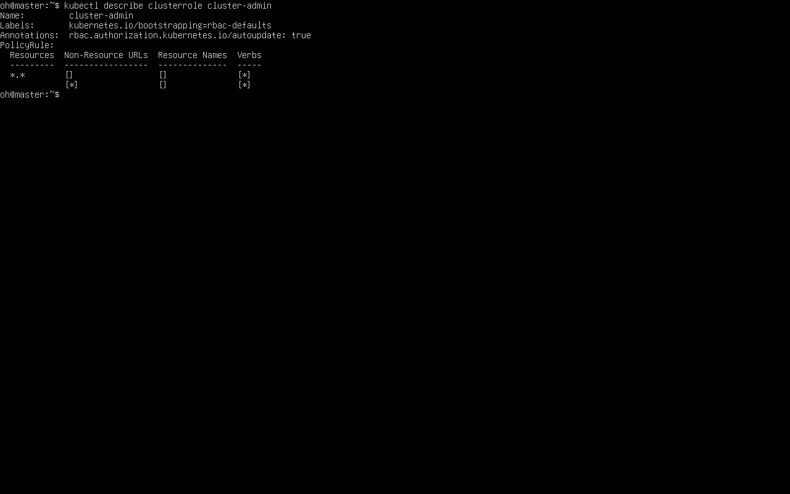
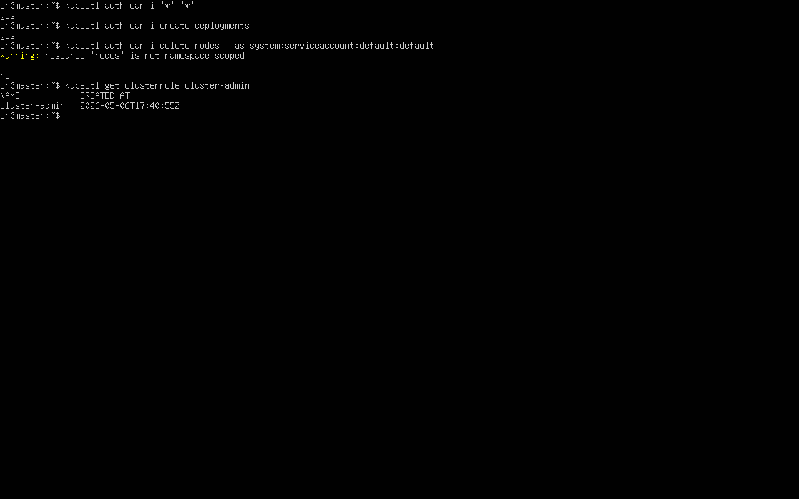
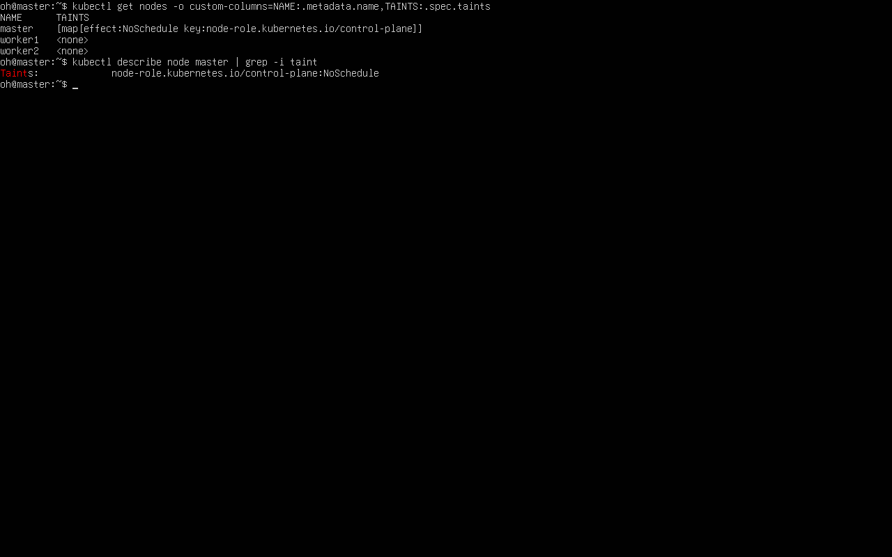
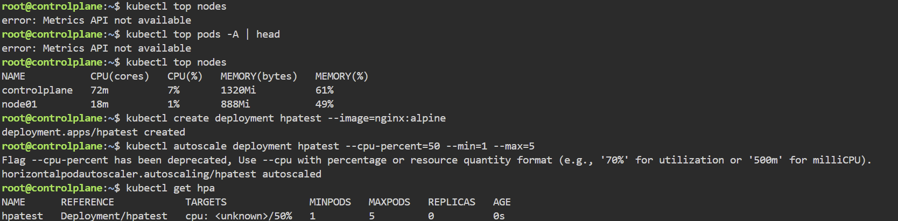
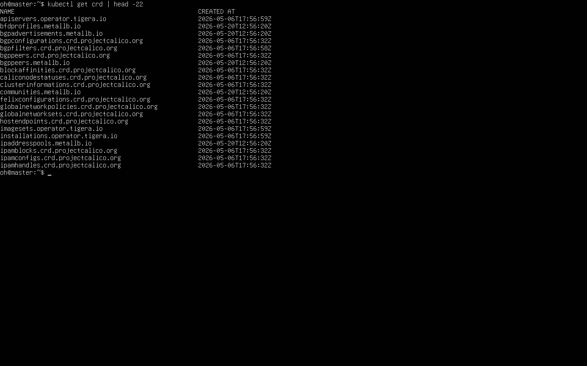

운영 클러스터 주차. RBAC로 권한을 제약하고(Role/Binding·인증서·토큰), 스케줄링(테인트·어피니티)과 HPA로 배치·스케일링을 제어하며, CRD·오퍼레이터로 플랫폼을 확장하는 순서로 실습했다.

## RBAC

권한 묶음(Role/ClusterRole)을 주체(RoleBinding/ClusterRoleBinding)에 연결해 `kubectl` 사용자와 서비스 계정의 권한을 제약한다. Role은 네임스페이스 범위, ClusterRole은 클러스터 전역이다.

```bash
. .\grep.ps1                                       # 파워셸 grep 추가
kubectl api-versions | grep rbac                   # RBAC API 확인
kubectl get clusterroles | grep admin
kubectl describe clusterrole cluster-admin         # 사실상 전권 정의 확인
```


*▲ `kubectl describe clusterrole cluster-admin` — PolicyRule이 `*.*` / Verbs `[*]` 로 모든 권한을 가진 역할.*

### 사용자 인증서와 컨텍스트

클라이언트 인증서로 신원을 만들어 자격 증명·컨텍스트로 등록한다.

```bash
kubectl cp user-cert-generator:/certs/user.key user.key
kubectl cp user-cert-generator:/certs/user.crt user.crt

kubectl config set-credentials reader \
  --client-key=./user.key --client-certificate=./user.crt --embed-certs=true   # 자격 증명 등록

kubectl config set-context reader --user=reader \
  --cluster $(kubectl config view -o jsonpath='{.clusters[0].name}')           # 컨텍스트 생성

kubectl get pods --as reader@kiamol.net            # 롤바인딩 전에는 거부됨
```

### 롤바인딩

`view` 클러스터롤을 RoleBinding으로 default 네임스페이스에서만 `reader`에게 연결한다.

```yaml
apiVersion: rbac.authorization.k8s.io/v1
kind: RoleBinding
metadata:
  name: reader-view
  namespace: default                   # 적용 범위
subjects:
- kind: User
  name: reader@kiamol.net              # 주체
  apiGroup: rbac.authorization.k8s.io
roleRef:
  kind: ClusterRole
  name: view                           # 부여할 권한 묶음
  apiGroup: rbac.authorization.k8s.io
```

```bash
kubectl apply -f role-bindings/reader-view-default.yaml
kubectl get pods --as reader@kiamol.net                    # default 조회 허용
kubectl get pods -n kube-system --as reader@kiamol.net     # kube-system 거부
kubectl delete -f sleep/ --as reader@kiamol.net            # 삭제 거부
```

!!! capture "--as 신원 권한 거부/허용 비교"
    (실습 화면 캡처)

### 서비스 계정·토큰

서비스 계정은 권한을 따로 주기 전엔 권한이 없다. 권한 확인은 `kubectl auth can-i`로 한다.

```bash
kubectl auth can-i "*" "*"
kubectl auth can-i "*" "*" --as system:serviceaccount:kiamol-ch17:default
```

토큰만 삭제하면 서비스 계정은 두고도 권한을 회수한다.

```bash
openssl x509 -text -noout -in /certs/user.crt | grep Subject:   # 인증서 Subject(그룹) 확인

. .\base64.ps1                                                   # 윈도우 base64 추가
kubectl get secret sre2-sa-token -n kiamol-authn-sre -o jsonpath='{.data.token}' | base64 -d > sa-token
kubectl config set-credentials ch17-sre --token=$(cat sa-token)

kubectl delete secret sre2-sa-token -n kiamol-authn-sre         # 토큰 삭제로 권한 회수
```


*▲ 직접 구축한 클러스터에서 `kubectl auth can-i` — 관리자는 `*/*` 허용(yes), 기본 서비스 계정의 노드 삭제는 거부(no).*

## 스케줄링과 HPA

스케줄러가 노드 자원·점유량·배치 정책을 종합해 파드 배치를 결정한다.

테인트(`NoSchedule`)를 건 노드는 일치하는 톨러레이션이 있는 파드만 배정한다.

```bash
kubectl taint nodes --all kiamol-disk=hdd:NoSchedule       # 테인트 추가 → 톨러레이션 없으면 Pending
kubectl apply -f sleep/sleep2.yaml
kubectl get po -l app=sleep2
kubectl apply -f sleep/update/sleep2-with-tolerations.yaml # 톨러레이션 추가 → 배정
kubectl taint nodes --all kiamol-disk=hdd:NoSchedule-      # 테인트 제거
```

```yaml
tolerations:                # 용납 가능한 테인트
  - key: "kiamol-disk"
    operator: "Equal"       # 키·값·이펙트 모두 일치해야 함
    value: "hdd"
    effect: "NoSchedule"
```

### 어피니티

노드 어피니티는 노드 레이블 대상 표현식을 쓴다. 같은 `matchExpressions` 안은 AND, 여러 `matchExpressions`는 OR다.

```yaml
affinity:
  nodeAffinity:
    requiredDuringSchedulingIgnoredDuringExecution:
      nodeSelectorTerms:
      - matchExpressions:
        - key: kubernetes.io/arch    # 레이블 대상
          operator: In
          values:
          - amd64                    # amd64 노드에서만 실행
```

파드 어피니티/안티어피니티는 `topologyKey` 기준으로 다른 파드와 같은/다른 노드 배치를 지시한다.

```bash
kubectl apply -f sleep/update/sleep2-with-nodeAffinity-required.yaml
kubectl get pods -l app=numbers -o wide   # 같은 노드 배정 확인
```


*▲ master 노드에 `node-role.kubernetes.io/control-plane:NoSchedule` 테인트가 있어 일반 파드는 배정되지 않는다(worker는 테인트 없음).*

### HPA

HPA는 부하에 맞춰 레플리카를 자동 조절한다. 부하 측정에는 metrics-server가 필요하다. v1은 CPU 한 지표만, v2는 다중 지표·스케일다운 제어를 지원한다.

```yaml
# HPA v1
spec:
  scaleTargetRef:
    apiVersion: apps/v1
    kind: Deployment
    name: pi-web-lab
  minReplicas: 1
  maxReplicas: 5
  targetCPUUtilizationPercentage: 75
```

```yaml
# HPA v2 — 스케일다운 동작 정의
metrics:
- type: Resource
  resource:
    name: cpu
    target:
      type: Utilization
      averageUtilization: 75
behavior:
  scaleDown:
    stabilizationWindowSeconds: 30   # 기준 아래로 내려간 뒤 30초 대기
    policies:
    - type: Percent
      value: 50                      # 현재 파드 수의 50%씩 감소
      periodSeconds: 15
```

```bash
kubectl apply -f pi/                          # HPA 포함 앱 배치
kubectl get hpa pi-cpu

.\loadpi.ps1                                  # 부하 (윈도우)
# chmod +x ./loadpi.sh && ./loadpi.sh         # (리눅스/macOS)

kubectl get hpa pi-cpu                        # 스케일업 확인
kubectl top pods -l app=pi-web                # 파드별 CPU 확인
kubectl apply -f pi/update/hpa-cpu-v2.yaml    # v2로 변경
```


*▲ metrics-server 설치 후 `kubectl top nodes` 로 노드 CPU·메모리를 확인하고, `kubectl autoscale` 로 만든 HPA가 등록된 모습.*

## CRD와 오퍼레이터

REST API 패턴을 그대로 확장해 사용자 정의 리소스 타입을 만든다. CRD로 타입을 정의하고, 커스텀 컨트롤러가 변화를 주시해 워크플로를 실행하며, 오퍼레이터는 CRD+컨트롤러로 복잡한 앱의 생애 주기를 관리한다.

```yaml
apiVersion: apiextensions.k8s.io/v1
kind: CustomResourceDefinition
metadata:
  name: todos.ch20.kiamol.net    # <복수형>.<group> 형식
spec:
  group: ch20.kiamol.net
  scope: Namespaced              # 네임스페이스 / 클러스터 범위
  names:
    plural: todos
    singular: todo
    kind: ToDo
  versions:
    - name: v1
      served: true               # API로 다룰 수 있음
      storage: true              # etcd에 저장
      schema:
        openAPIV3Schema:
          type: object
          properties:
            spec:
              type: object
              properties:
                item:
                  type: string
```

```bash
kubectl apply -f todo-custom/                 # CRD 배치
kubectl get crd -l kiamol=ch20
kubectl apply -f todo-custom/items/           # 사용자 정의 리소스 생성
kubectl get todos
```

!!! warning "CRD를 삭제하면 그 리소스가 모두 함께 삭제된다"
    `kubectl delete crd todos.ch20.kiamol.net` 실행 시 해당 CRD로 만든 모든 객체가 함께 사라진다.

### 커스텀 컨트롤러

`User` CRD의 변화를 컨트롤러가 주시하다 네임스페이스·서비스 계정·토큰을 대신 만든다. 사용자를 지우면 관련 네임스페이스도 정리된다.

```bash
kubectl apply -f users/crd/                   # User CRD 배치
kubectl apply -f users/update/                # 리소스 배치
kubectl logs -l app=user-controller --tail 4  # 컨트롤러 동작 로그
kubectl delete user tester3                   # 삭제 → 네임스페이스 정리
```


*▲ `kubectl get crd` — Calico·MetalLB·Tigera 오퍼레이터가 등록한 사용자 정의 리소스(CRD)들.*

### 오퍼레이터

오퍼레이터는 NATS·MySQL 같은 복잡한 시스템을 YAML 몇 줄로 띄우고, 내부적으로 스테이트풀셋·서비스·비밀값을 생성한다.

```yaml
# NATS 메시지 큐 클러스터
apiVersion: nats.io/v1alpha2
kind: NatsCluster
metadata:
  name: todo-list-queue
spec:
  size: 3
  version: "1.3.0"
```

```yaml
# 복제본 MySQL 클러스터
apiVersion: mysql.presslabs.org/v1alpha1
kind: MysqlCluster
metadata:
  name: todo-db
spec:
  mysqlVersion: "5.7.24"
  replicas: 2
  secretName: todo-db-secret
```

```bash
kubectl apply -f todo-list/msgq/              # 메시지 큐 생성
kubectl get nats
kubectl apply -f todo-list/db/                # DB 생성
kubectl get mysql
helm uninstall mysql-operator                 # 정리 — 잔여 리소스는 직접 정리
```

!!! capture "get nats / get mysql"
    (실습 화면 캡처)

## 막혔던 점

- 파워셸에 `grep`/`base64` 없음 → `. .\grep.ps1`·`. .\base64.ps1` 로드. grep은 `Select-String` 대체 가능.
- `Forbidden` → 롤바인딩 전이거나 권한 없는 신원이면 정상. `kubectl auth can-i`로 검증, 필요 시 Role/RoleBinding 추가.
- 그룹명 미검증 → 쿠버네티스는 그룹명을 검사하지 않음. 인증서 Subject와 RoleBinding의 그룹을 직접 일치시켜야 함.
- 노드셀렉터·`required` 어피니티로 Pending → `kubectl get nodes --show-labels`로 레이블 확인. 강제 불필요 시 `preferred`로 완화.
- HPA TARGETS `<unknown>` → metrics-server 미설치. 설치 후 약 60초 대기 뒤 재확인.
- 토큰 삭제 후 잠시 접근됨 → 회수 반영에 시간 소요. `sleep 30` 후 재시도.
